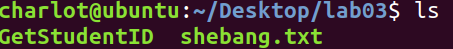

# Lab03b Assignment

> 班级：192112
> 学号：19373073
> 姓名：何潇龙

## 0. （选做，不算分，不限语言）批量删除 IDEA 工程文件

参考如下的目录结构：

```shell
./sp_java/
├── .idea
│   ├── .gitignore
│   ├── misc.xml
│   ├── modules.xml
│   └── workspace.xml
├── sp_java.iml
└── src
    ├── Test.class
    └── Test.java
```

在当前目录下可能存在**多个**类似于如上 `sp_java` 工程的文件夹。

要求批量删除**这些**文件夹中的 IDEA 工程文件，转换成如下的干净的目录结构。

```shell
./sp_java
└── src
    └── Test.java
```

## 1. shebang

- 假如在脚本的第一行放入`#!/bin/rm`或者在普通文本文件中第一行放置`#!/bin/more`，然后将文件设为可执行权限执行，看看会发生什么，并解释为什么。

- `#!/bin/rm`

描述发生了什么(截图)

先将`#!/bin/rm`插入到脚本第一行，查看目录中的文件（实验文件为shebang.txt



赋予执行权限再执行，再次查看目录中的文件，发现shebang.txt消失了


为什么

因为脚本中的第一句意思为执行bin中的rm，rm的作用是删除文件，所以文件被删除

- `#!/bin/more`

描述发生了什么(截图)

文件内容被打出来了


为什么

和上一题同理，也是执行bin/后的命令，more用于分页显示文件内容，这里只有两行因此全显示了出来。

## 2. 运行、打印

- 编写一个 bash 脚本，执行该脚本文件将得到两行输出，第一行是你的学号，第二行是当前的日期（考虑使用`date`命令）。对该脚本文件的要求是
  - 文件名为`date-${你的学号}`，比如`date-15131049`
  - 用户可以在任意位置**只需要输入文件名**就可以执行该脚本文件
  - **不破坏除用户家目录之外的任何目录结构**，即不要在家目录之外的任何地方增删改任何文件
    **请详细叙述你的操作过程以及操作过程的截图，并给出你所编写的脚本文件的代码。**
  
  首先使用vi编辑器编辑脚本
  
  
  
  之后在bashrc文件中追加脚本的地址进入环境变量中，这样就可以在各个地方打开该文件。
  
  
  
  之后再执行：
  
  

## 3. 正则

- 完成[LeetCode: 193. Valid Phone Numbers](https://leetcode.com/problems/valid-phone-numbers/) | [leetcode-cn](https://leetcode-cn.com/problems/valid-phone-numbers/) (体会`grep -E`, `grep -P`, `egrep`, `awk`等的差异)

```bash
grep -P '^([0-9]{3}-|\([0-9]{3}\) )[0-9]{3}-[0-9]{4}$' file.txt
```

AC 截图：


## 4. 文件读入

- 完成[LeetCode: 195. Tenth Line](https://leetcode.com/problems/tenth-line/) | [leetcode-cn](https://leetcode-cn.com/problems/tenth-line/)，给出你的代码和 AC 截图。(提示：[怎么读取每一行](http://blog.sina.com.cn/s/blog_605f5b4f0101b0sd.html))

```bash
i=0
cat file.txt | while read line
do
i=$((i+1))
    if [ $i -eq 10 ]; then
        echo $line
    fi 
done
```

AC 截图：


## 5. 语法

- 完成一个简单的交互设计，根据用户输入输出对应内容，具体交互内容随意，要求至少用上`select`，`case`和`read`。

```bash
#!/bin/bash
echo "请选择你想买的手机"
read phone
case $phone in
	Apple | "苹果" ) echo "你选择了苹果手机";;
	Samsung | "三星" ) echo "你选择了三星手机";;
	Huawei | "华为" ) echo "你选择了华为手机";;
	Xiaomi | "小米" ) echo "你选择了小米手机";;
	* ) echo "不好意思本店没有这种手机"
esac
echo "请选择你想要的内存大小的序号"
select size in "64G" "128G" "256G"
do
	echo "你选择了 $size 的手机"
	break
done
exit 0
```

交互体验截图：


## 6. 综合实验

- 编写 Shell 脚本`addowner.sh`将某目录下面所有的文件名后面加上文件所有者的名字。比如`a.txt`和`file`的所有者都为 owner，文件名修改后分别为`a[owner].txt`和`file[owner]`。
  - 使用用法：`./addowner 目录名称`。（若无目录名称这一参数，则默认为当前目录）
  - 对于子目录，名称不变。
  - （提示：为了测试效果，请通过`useradd`创建若干用户，并可通过`chown`改变文件所有者。另外，网上的答案是错的。）

```bash
#!/bin/bash
if [ $# -eq 1 ]; then 
	cd $1
fi
for filename in `ls`
do
	if [ ! -d $filename ];then
			List=(`ls -l $filename`)	
			Owner=${List[2]}
			prefix=${filename%.*}
			suffix=${filename##*.}
			if [ $filename = $prefix ]; then
				mv $filename "$filename[$Owner]"
			else
				mv $filename "$prefix[$Owner].$suffix"
			fi			
	fi
done
```

运行结果截图(包含目录、文件(含`.`与不含`.`)，并体现出多个文件所有者)：

先准备好测试文件，给不同文件分配不同拥有者


再测试函数


完成本综合实验的过程和体会：

完成这个实验借鉴了网上一些“批量命名”的思路，然后在重命名的时候遇到了一些困难，因为还是不大熟悉正则表达式所以用了很原始的方法，把"."前后的内容拆开再追加用户名。

## 7. 实验感想

这次实验操作性特别强，不仅熟悉了shell脚本的编写，而且学到了很多课本上没有学到的知识，比如正则表达式。看到自己写的脚本能有实际的效果还挺有成就感的。