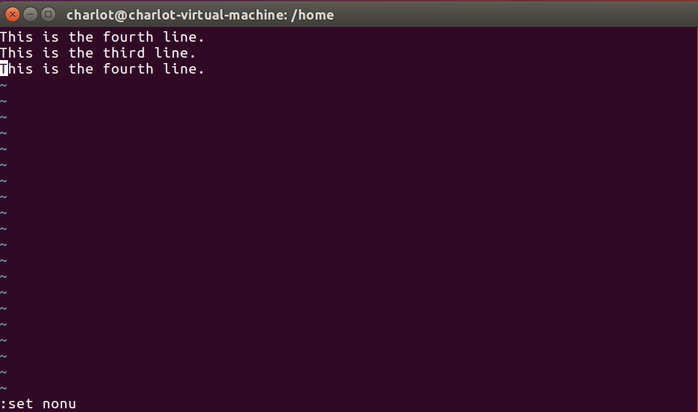

# Lab01 Assignment

> 班级：192112
> 学号：19373073
> 姓名：何潇龙

## 实验准备

- 请安装一个合适的 Linux 系统，你安装的 Linux 发行版及版本号是什么？内核版本号是什么？

  截图：

  发行版本号：

  

  内核版本号：

  

  答案：

  发行版：Ubuntu，版本号：16.04.6

  内核版本号：4.15.0-45-generic

- 查看你的根目录下有哪几个子目录，每个子目录主要用来做什么用的？

  截图：

  答案：

  ```
  /bin	用来存放二进制可执行文件
  /dev	device，任何设备都以文件的形式存放在这个目录中。
  /lost+found	每一个分区在它的上级目录有该目录，存放出现错误时保存的文件。
  /opt	optional，可选的软件包，即第三方软件。可以将除了系统自带软件之外的其他软件安装到这个目录下。
  /run	最近一次开机后所产生的各项信息，如当前的用户和正在运行中的守护进程等。
  /srv	service，存放一些服务启动后所需的数据。
  /usr	包含绝大部分所有用户(users)都能访问的应用程序和文件包含二进制文件，库文件。文档和二级程序的源代码。
  /boot	主要存放开机时用到的引导文件，如linux内核文件和开机菜单与开机所以需要的配置文件。
  /etc	配置文件、启动脚本等 (etc)包含所有程序所需的配置文件以及系统的配置文件。也包含了用于启动/停止单个程序的启动和关闭shell脚本。
  /media	media（媒体），存放可移除的媒体设备
  /proc	特殊的动态目录，用以维护系统信息和状态，包括当前运行中进程 (processes) 信息。包含系统进程的相关信息，是一个虚拟的文件系统，包含有关正在运行的进程的信息，系统资源以文本信息形式存在。
  /sbin	存放一些只有root账户才有权限执行的可执行文件
  /sys	system，与/proc类似也是一个虚拟文件系统，存放系统核心与硬件相关信息管理设备文件。
  /var	经常变化的(variable)文件，诸如日志或数据库等代表变量文件。
  /cdrom	专门用来挂载光盘的目录，有些发行版将该目录放在media或mnt目录下。
  /home	系统默认的用户的家目录，每当新建一个用户系统都会在这个目录下创建以该用户名为名称的目录作为该用户的家目录。并且在命令行中代表当前用户的家目录，redhat表示
  /lib	library，存放着系统开机时所需的函数库以及/bin和/sbin目录下的命令会调用的函数库。
  /mnt	mount，临时挂载的设备文件，临时安装目录，系统管理员可以挂载文件系统。是系统管理员临时安装文件的系统安装点。
  /root	系统管理员root的主目录。
  /snap：这是使用snap安装软件产生的目录
  /tmp	temporary，存放系统运行过程中使用的一些临时文件，可以被所有用户访问，系统重启时会清空该目录。
  ```

  

- 查看自己的 ip 地址，并 ping 一下 baidu.com 看网络是否连通？

  命令：

  查看ip地址的命令：hostname -I

  看网络是否连通的命令：ping baidu.com

  截图：

  

  

- 用软件安装命令下载 build-essential。

  命令：sudo apt install build-essential

  截图：
  
  

## 1. Linux 命令操作

- Linux 命令行操作，请用你学到的 Linux 命令，实现以下操作，给出每一步你的命令行截图。
  - 用 wget 从`https://github.com/BUAA-SE-2021/patpat/releases/download/v0.1.3/patpat-linux-amd64`下载你们的 Linux 版 OOP 课 Java 自助评测机 patpat
  - `https://github.com/BUAA-SE-2021/sp-labs/lab01/lab01.zip`处下载实验压缩包
  - 解压`lab01.zip`。
  - 进入`lab01`目录,进入子目录`etc`，打印当前路径并在当前路径下创建名为`a1`的目录，并在`a1`目录中创建名为`b1`的目录。
  - 进入`b1`目录中，创建两个文件`a.txt`，`b.txt`。
  - 退回子目录`etc`，删除目录`a1`。
  - 将`etc`目录下所有以`tmp`开头的文件移动到`lab01`目录下的`Download`目录下的`tmp`目录中。
  - 查看`tmp`目录下`a1005.cpp`的内容。
  - 查看`tmp`目录下`a1009.cpp`的前十行和后十行。
  - 将`tmp`目录下的所有文件打成一个`tar`包，并命名为并命名为`tmp.tar.gz`。
  - 返回`lab01`目录，列出当前目录下的文件大小。
  - 用命令找出空目录并将空目录删除。

命令：

```shell
# 不完整的部分自行补充，填写必要注释
code wget https://github.com/BUAA-SE-
2021/patpat/releases/download/v0.1.3/patpat-linux-amd64# 下载
code wget https://hub.fastgit.org/BUAA-SE-2021/sp-labs/raw/main/lab01/lab01.zip# 下载实验资料，这里因为连不上github所以采用了另一个链接下载
code unzip lab01.zip# 解压
code cd lab01/etc# 进入目录
code pwd# 打印当前路径
code mkdir a1# 创建目录`a1`
code mkdir a1/b1# 创建子目录`b1`
code cd ../..# 返回子目录`etc`
code rm -r a1# 删除`a1`
code find . -name 'tmp*' -exec mv {} ../Download/tmp \;# 移动
code cat ../Download/tmp/a1005.cpp# 查看
code head -10 ../Download/tmp/a1009.cpp  tail -10 ../Download/tmp/a1009.cpp# 查看前十行和后十行
code tar -cf tmp.tar.gz tmp# 打包，首先要进到Download目录里， cd .. cd Download
code cd ..# 返回`lab01`目录
code du -h# 列出当前目录下的文件大小
code find -type d -empty# 用命令找出空目录
code rm -r ./upload# 删除空目录
```

必要的实验截图(如查看前十行、查看文件大小的展示效果)

1、下载patpat


2、下载实验材料


3、解压lab01


4、进入目录


5、打印路径


6、创建目录a1


7、创建子目录b1


在b1中创建两个文件


8、返回子目录etc


9、删除a1


10、移动


11、查看


12、查看前十行和后十行


13、打包


14、返回lab01目录


15、列出当前目录下的文件大小


16、用命令找出空目录


17、删除空目录


## 2. vi 模式

- vi 编辑器有哪几种模式？简述这几种模式间如何互相切换？

模式：

- 1、命令模式(command mode)
- 2、插入模式(insert mode)
- 3、底行模式(last line mode)(ppt上是末行模式)

如何切换：

命令模式：使用 vi 打开文件后默认进入该模式

插入模式：在命令模式下输入操作符(如`i`)进入插入模式，`Esc`从编辑模式返回命令模式

底行模式：在命令模式下输入`:`或`/`进入底行模式，`Esc`清空底行或返回命令模式

## 3. vi 命令

> 写出以下⼀系列操作使⽤的**命令**（底⾏模式的命令加上 : 或 / ）：

### 3.1. ⽤ `vi` 在当前⽤户家⽬录下新建⽂件 `testfile` 并打开

```shell
vi testfile
```


### 3.2. 设置显示⾏号

```shell
:set number
```


### 3.3. 进⼊ `insert mode` ，输⼊ `3` ⾏⽂本

```plain
This is the first line.
This is the second line.
This is the third line.
```


### 3.4. 返回到 `command mode` ，将光标移动到第 `2` ⾏，复制这⼀⾏

```shell
esc
↑
yy
```

### 3.5. 移动光标到⽂档最后⼀⾏，将复制内容粘贴到这⼀⾏后⾯

```shell
↓
p
```


### 3.6. 移动光标到第⼀⾏，删除第⼀⾏

```shell
↑↑↑
dd
```


### 3.7. 从⽂档开头开始查找 `second` ，然后查找下⼀个

```shell
/second
n
```

### 3.8. 将全部 `second` 替换为 `fourth` ，替换过程不需要询问

```shell
：%s/second/fourth/g
```


### 3.9. 取消显示⾏号

```shell
:set nonu
```



### 3.10. 保存修改并退出 `vi`

```shell
:wq testfile
```

### 3.11. 再次⽤ `vi` 打开 `testfile` ，另存为 `testfile2`

```shell
vi testfile
:w testfile2
```

## 4. POSIX

- 什么是 POSIX 标准？哪些操作系统支持 POSIX 标准？

  POSIX 表示可移植操作系统接口。Windows，Linux，Solaris，HP的系统都支持。

## 5. LSB

- 什么是 LSB 标准？分析它和 POSIX 标准的异同。

  LSB是一套核心标准,它保证了LINUX发行版同LINUX应用程序之间的良好结合,具体地说,它是:1、一个二进制接口规范，是指应用程序在系统间迁移时不用重新编译，保证应用程序在所有经过认证的LINUX发行版上都具有兼容性。2、一个测试规范，测试LINUX发行版和LINUX应用程序是否符合LSB标准。3、搭建遵从LSB规范的应用程序的开发环境。4、为在纯LSB环境下运行和测试应用程序而提供的运行环境样本。LSB包括两个核心部分，分为普通规范和特定处理器规范。

  LSB 以 POSIX 和 SUS 标准为基础，并对其他领域（例如图形）中源代码的一些标准进行了扩充，还增加了对二进制可执行文件格式规范的定义，从而试图确保 Linux 上应用程序源码和二进制文件的兼容性。

## 6. 实验感想

这次试验让我对linux有了初步的了解，稍微熟悉了一下各种指令和操作。但是感觉命令实在还是有点记不下来，还需要多加练习变得更加熟练。然后感觉虚拟机上的操作还是挺有意思的，vi编辑器那一块一开始因为不熟悉各种模式疯狂出错，后面慢慢习惯了之后还是有点成就感的。总之要多练！然后再也不要压ddl了！！早布置早完成！

