# Lab02 Assignment

> 班级：192112
> 学号：19373073
> 姓名：何潇龙

## 1. GCC

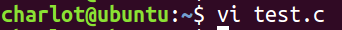

先用```vi test.c```创造一个c文件，进入命令行编辑。

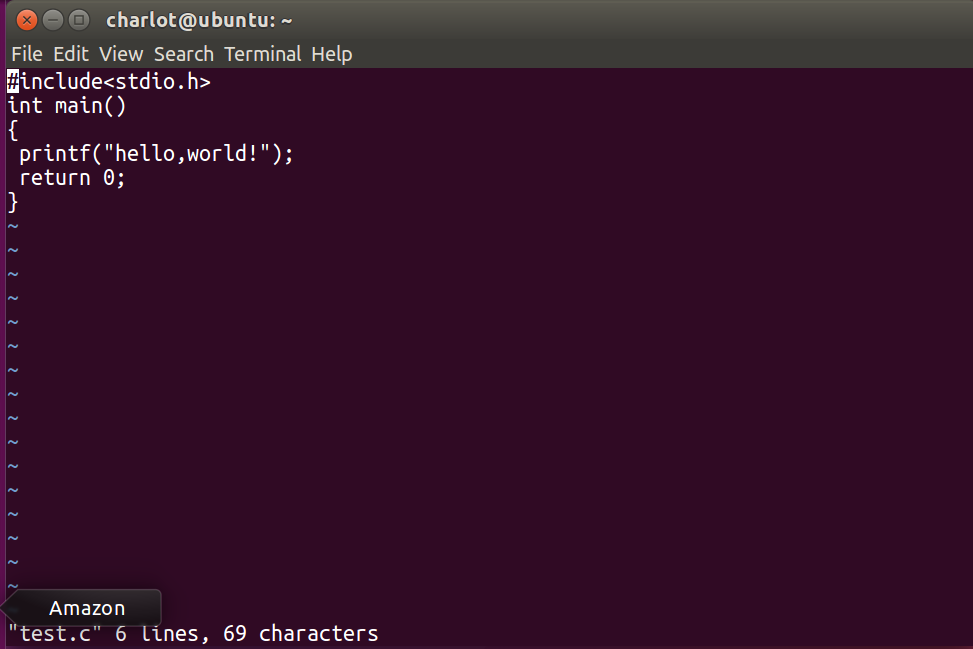

- GCC将一个源程序转换为可执行文件经历了哪些主要步骤?

  ```预处理、编译、汇编并链接形成可执行文件```

- 请利用`test.c`用 GCC 命令将其将其转换为可执行程序的主要过程表示出来。 (命令和截图）

①```gcc -E test.c -o test.i``` 将 test.c 预处理输出 test.i 文件

②```gcc -S test.i```将预处理输出文件 test.i 编译成 test.s 文件。

③```gcc -c test.s```将汇编语言文件 test.s 汇编成目标代码 test.o 文件。

④```gcc test.o -o test```将目标代码文件 test.o 链接成最终可执行文件 test。

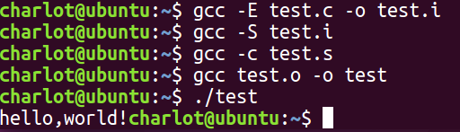

## 2.静态库

-  解压 lab02.zip

```unzip lab02.zip```

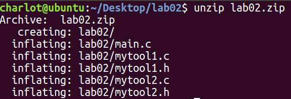

- 使用 gcc 命令分别将`mytool1.c`和`mytool2.c` 编译成 .o 目标文件

``` gcc -c mytool1.c -o mytool1.o```

``` gcc mytool2.c -o mytool2.0```

- 说明上述两个命令完成了什么事？
  第一个建立mytool1.c和mytool2.c的静态库libmylib.a

  第二个将静态库链接到可执行文件main中

- 查看`main`文件大小，并记录
  ```du main -h```

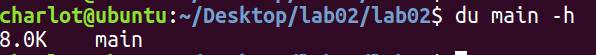

- 执行`./main`
  `./main`

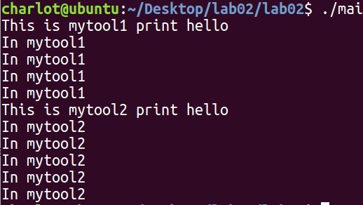

- 删除之前生成的静态库文件，重新执行`./main`命令，对比上一步骤得到的结果，你有什么发现？并解释原因。
  没有区别

  说明在链接成可执行程序时多需要的信息已经 在 可执行文件中了，不需要单独留存一个静态库文件

  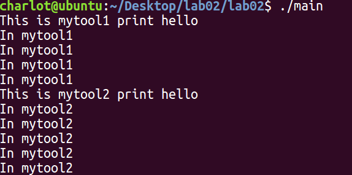

## 3.动态库

 - 执行下面两个命令

      ```shell
      gcc -c -fPIC mytool2.c -o mytool2.o
      gcc -c -fPIC mytool1.c -o mytool1.o
      gcc -shared -o libmylib.so mytool2.o mytool1.o
      ```

      ```shell
      gcc -o main main.c -L. -lmylib
      ```

- 查看`main`文件大小，并和之前的作比较，解释原因。
```du main -h```

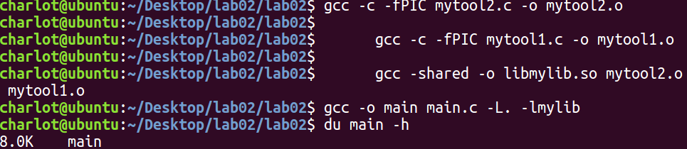

仍然是8k没有区别。可能因为文件本身就比较小，采用动态库和静态库都不需要很大的容量，因此没有太大区别。

- 执行命令将当前目录添加到库搜索路径中

     ```shell
      export LD_LIBRARY_PATH=$LD_LIBRARY_PATH:;
     ```

- 执行`./main`
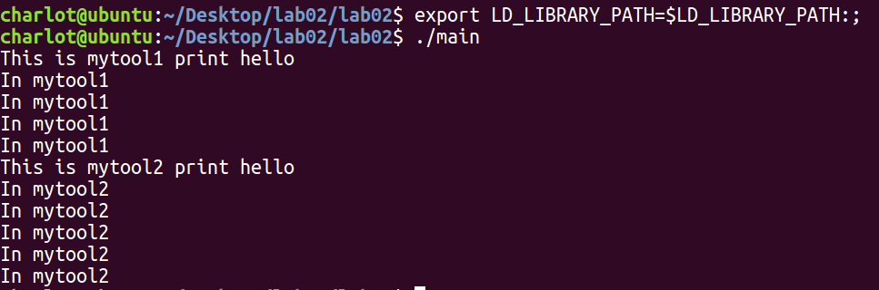
- 删除之前生成的动态库文件，重新执行`./main`命令，对比上一步骤得到的结果，你有什么发现？
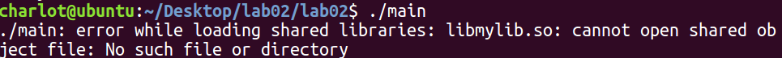

如果动态库文件消失，则原来的可执行文件就无法运行。说明可执行文件的执行需要动态库文件的存在。

- 综合实验，你觉得静态库和动态库的区别和相同点是什么？谈谈他们的优缺点。

  **同**
  共享代码，代码封装，都会产生lib文件
  **异**
  静态链接库：lib包含函数代码本身，当要使用时，连接器会找出程序所需的函数，然后将它们拷贝到执行文件，由于这种拷贝是完整的，所以一旦连接成功，静态程序库也就不再需要了。**优点**：运行时可以被删除，发布程序的时候不需要提供对应的库，加载速度快。**缺点**：较为固定，发生了改变需要重新编译。打包到应用程序中体积会变大。
  动态链接库：lib包含了函数所在的dll文件和文件中函数位置的信息，某个程序在运行中要调用某个动态链接库函数的时候，操作系统首先会查看所有正在运行的程序，看在内存里是否已有此库函数的拷贝了。如果有，则让其共享那一个拷贝；只有没有才链接载入。**优点**：执行程序体积小 ，动态库更新了不需要重新编译程序**缺点**：运行时必须存在。如果没有被打包到应用程序中，加载速度相对较慢。

  

## 4. GDB

粘贴各步骤结果截图

（3）执行 gdb a.out 命令

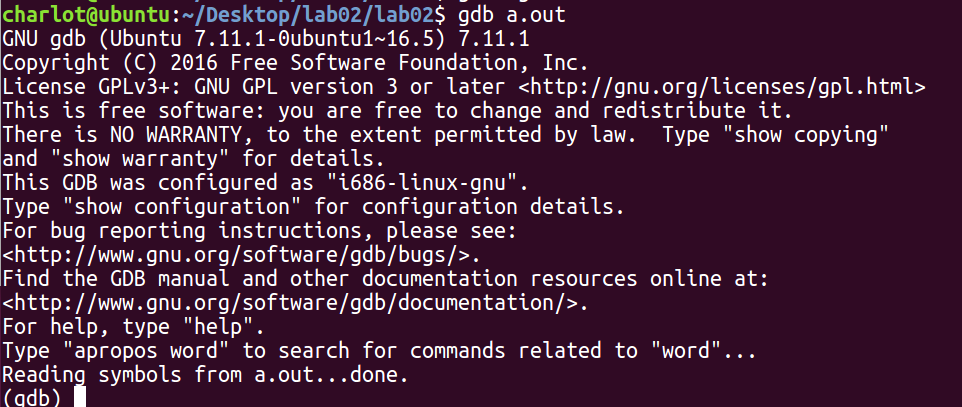

（5）在 main 函数处设置断点

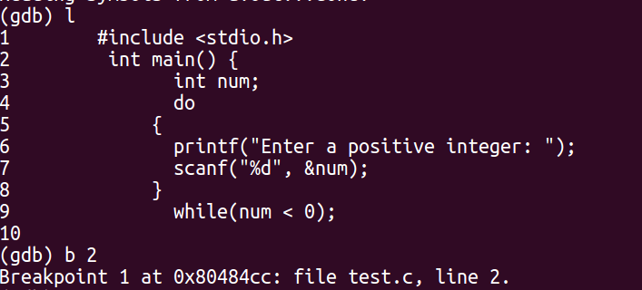

（6）输入 run 命令开始程序

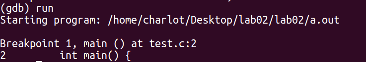

（7）多次输入 next 命令使程序运行到第 13 行,使用 print 命令打印 num 的值

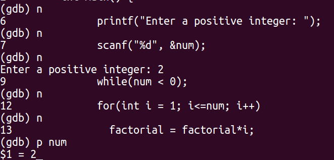

（8）继续调试至程序第 16 行,使用 print 命令打印 factorial 的值

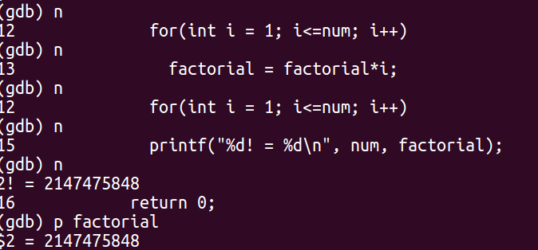

（9）使用 run 命令再次调试程序

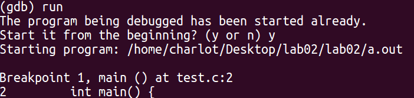

（10）在程序第 10 行加入断点

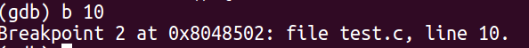

（11）使用 continue 命令使程序运行到断点处

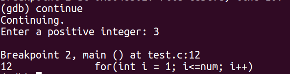

（12）使用 next 命令

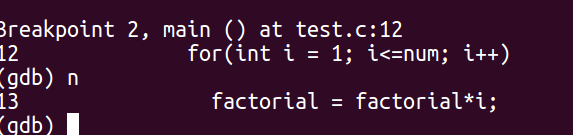

（13）使用 print 命令打印 i 和 factorial 的值

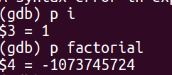

（14）使用 p factorial=1 命令改变 factorial 的值

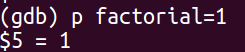

（15）使用 info locals 查看所有局部变量值

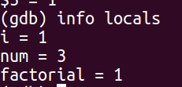

（16）继续调试至程序结束

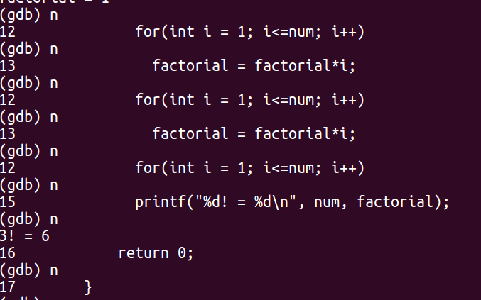

（17）说明源程序中存在的错误

源程序没有给factorial赋初始值。

**优点**：可以更直观的看到所有变量的取值，而且可以在调试过程中给变量赋值观察程序运行

## 5. Makefile

- 补全 makefile 文件

```shell
vpath %.h ./include
vpath %.c ./src
obj =fun1.o fun2.o main.o
ALL:main
	echo completed
main:main.o
	gcc $(obj) -Iinclude -L./lib -ldylib -o main
main.o:main.c fun1.o fun2.o dylib.h
	gcc -I./include -c ./src/main.c
fun1.o:fun1.c fun1.h
	gcc -I./include -c ./src/fun1.c
fun2.o:fun2.c fun2.h
	gcc -I./include -c ./src/fun2.c
.PHONY: clean ALL
clean:
	rm -rf fun1.o fun2.o main.o
```

执行结果如图：

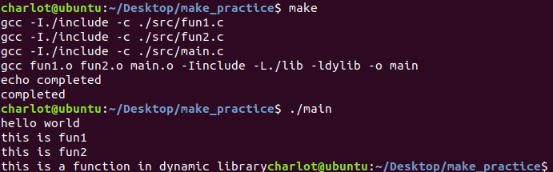

综合实验，Make 工具是如何知道哪些文件需要重新生成，哪些不需要的?

Makefile从终极目标开始往前倒退寻找依赖的次级目标，在依赖文件有变动的时候，Makefile会从最终目标往前找依赖文件比较时间戳，时间戳更新的需要重新编译。


## 6. 实验感想

gdb工具非常实用，vi编辑器的各种指令还需要熟悉，makefile感觉还是有点难...，我看到之前有同学用各种变量可以把makefile写得很简洁，我现在还只能把每条gcc指令列出来，还是要多加练习。