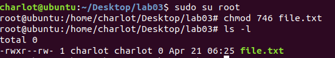

# Lab03a Assignment

> 班级：192112
> 学号：19373073
> 姓名：何潇龙

## 1. 文件权限

- 对一个文本文件`file.txt`执行命令：`#chmod 746 file.txt`。请解释该命令的含义并写出执行该命令后该文件的权限信息。(注：这里的`#`表示在管理员权限下完成，并不是命令的前缀。在 Shell 中`#`前缀会被当作注释，从而无效)

命令含义：改变文件的权限，746分别对应用户、组、其他用户权限，每一个数都是8进制数，每一位对应着读、写、执行权限，7意味着读写执行全是1，都可以执行，4意味着只有读权限，6意味着只有读和写权限。

该文件的权限信息(截图)：



## 2. 用户权限

- 假设系统中有两个用户，分别是 A 与 B ，这两个人共同支持一个名为 `project` 的用户组。假设这两个用户需要共同拥有`/srv/ahome/`目录的开发权，且该目录不许其他人进入查阅，请问该目录的权限配置应如何配置，写出配置所需的指令。并在你的机器上验证。（提示：请在 `/srv`下创建`/ahome`目录，并创建用户 A ， B ，用户组`project` ，并给 `/ahome`赋予合理的访问权限。）

（因为是在根目录下的src中操作，所以所有命令前都加了sudo，这里就省略了

```bash
mkdir ahome #新建目录
groupadd project #新建用户组
useradd -g project A 
useradd -g project B #新建用户A、B并划归到用户组下
chgrp project ahome #目录ahome所属组改为project
chmod 770 ahome #给目录赋予只有用户、同组用户才有读写执行的权限，其他用户均无法操纵
```


验证权限：


## 3. 管道

- 请写出命令`who | wc -l`的结果并分析其执行过程。

运行结果：


分析：

我的分析是:

`who`用于显示系统中有哪些使用者正在上面，当前系统使用者只有一个


`wc -l`用于统计一个文件中的行数，`who`作为`wc -l`的输入，`who`中只有一行，因此结果为1

## 4. 重定向

- 解释以下命令`sh test && cat a.txt || cat b.txt >f1 <f2 2>&1`'若命令执行到最后一个 `cat b.txt`,`f1`中的内容为`b.txt`的内容还是`f2`的内容

是`b.txt`的内容。

原因：

`cat b.txt >f1 <f2`中，重定向操作符按其出现的顺序自左向右执行。执行到最后一个 `cat b.txt`,时，它被指定为`f1`的输入，因此内容为`b.txt`

## 5. 环境变量

- 自己添加一个环境变量，名称是`STUDENT_ID`，值为你的学号，并编写一个C程序来获取该环境变量，并打印出来。**请详细叙述你的操作过程以及操作过程的截图，并给出C程序的代码。**

添加环境变量：

`export STUDENT_ID=19373073`

显示：

`echo $STUDENT_ID`

截图：


编写C代码：

```c
#include <stdio.h>
#include <stdlib.h>
int main() {
	const char* name = "STUDENT_ID";
	printf("%s\n", getenv(name));//使用getenv函数获取环境变量
	return 0;
}
```

编译c文件：

`gcc GetStudentID.c -o GetStudentID`

执行文件：

`./GetStudentID`

截图：


## 6. 实验感想

这次试验又熟悉了之前的各种命令，另外了解了shell编程里的管道、重定向、权限等操作。