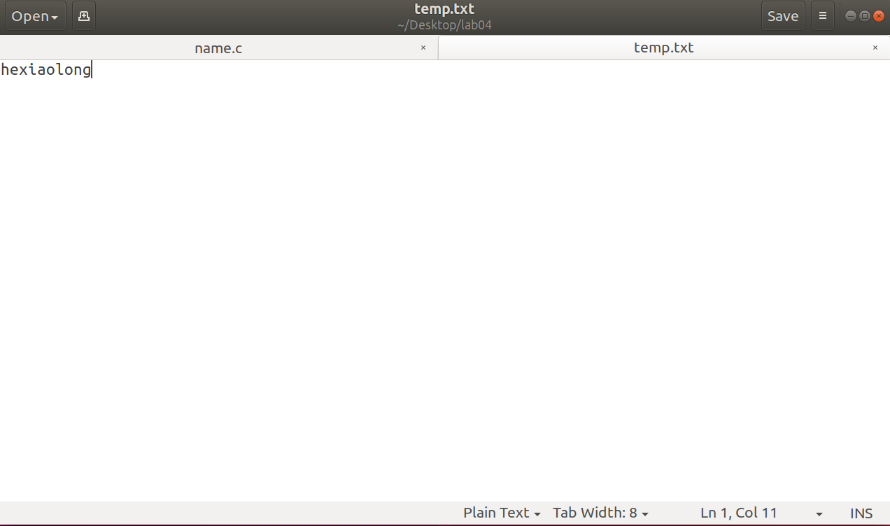
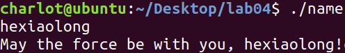
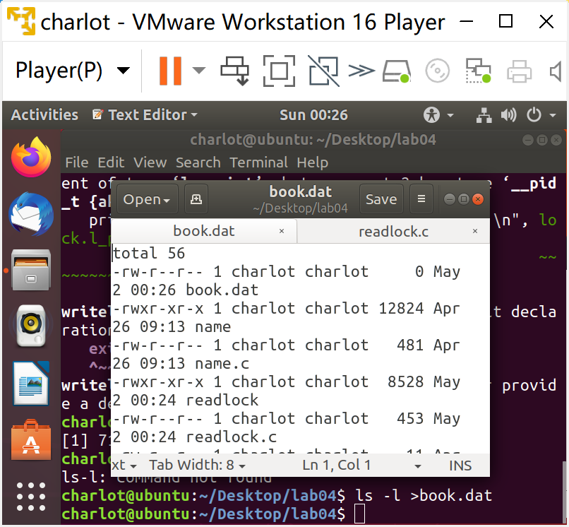
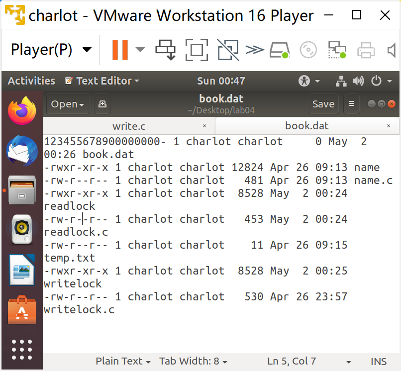
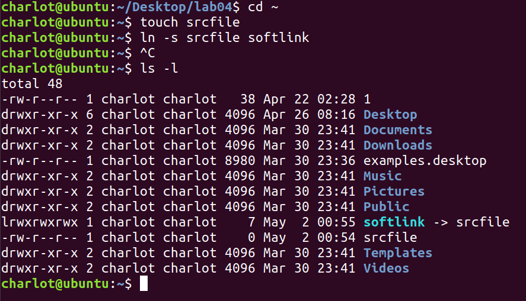
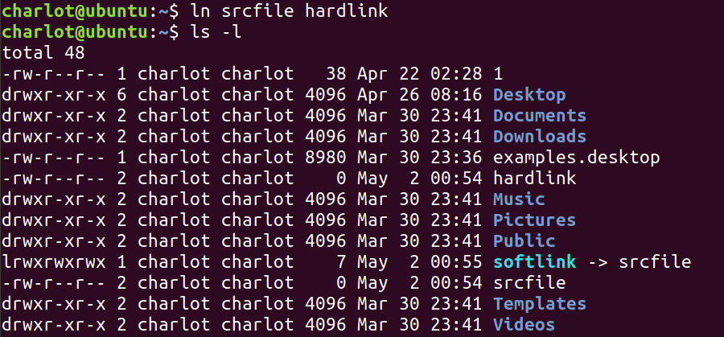
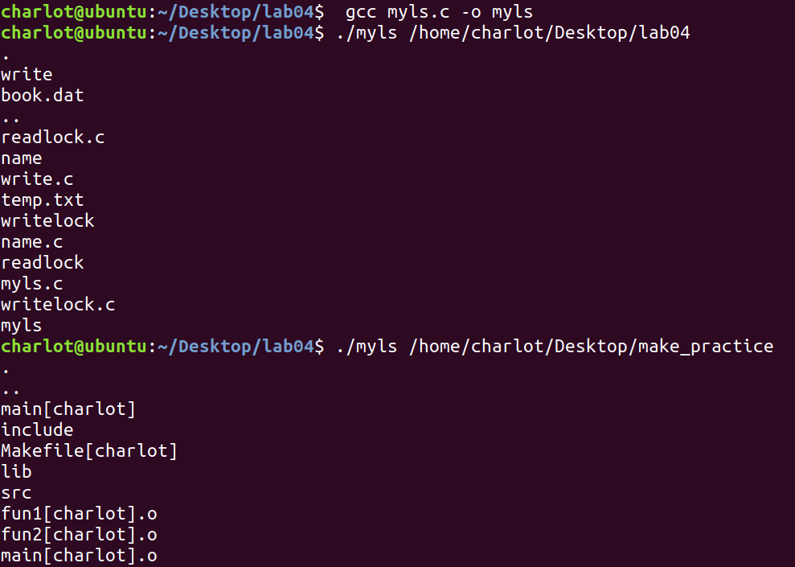
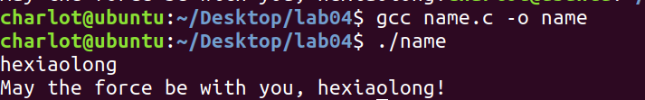

# Lab04 Assignment

> 班级：192112
> 学号：19373073
> 姓名：何潇龙

1. 简述文件描述符的作用并回答问题：文件描述符和文件是一对一对应的关系吗？

   ```
   文件描述符是已打开文件的索引，通过索引找到已打开文件。
   文件描述符和打开的文件并不是一一对应的关系，多个文件描述符可以指向同一个打开文件，这些文件描述符可以在相同或不同的进程中打开。
   ```

   

2. 写出文件 I/O 函数`open()`、`read()`、`write()`、`close()`都分别有哪些参数，每个参数的含义是什么？

   ```
   open(char* name, int how, mode_t mode)
   name是需要打开的文件名称（包括路径）
   how指定文件的打开模式
   当指定的打开模式为 O_CREAT 或 O_TMPFILE 时，必须提供 mode 参数指定文件的权限
   
   read(int fd, void *buf, size_t qty)
   fd是open操作所返回的文件描述符
   buf是指向存储数据的内存空间
   qty指所需要读取的数据的字节大小
   
   write(int fd, void *buf, size_t amt)
   fd是open操作所返回的文件描述符
   buf指向待写入的存储单元
   amt指写入数据的字节大小
   
   close(int fd)
   fd是open操作所返回的文件描述符
   ```

   

3. 创建一个文件，内容为你的姓名的全拼（如张三同学，文件中的内容即为`zhangsan`)。编写 c 语言程序实现以下功能：首先打开该文件并输出文件的内容，之后将文件的内容修改为`May the force be with you, ${姓名全拼}!`，比如`May the force be with you, zhangsan!`，输出修改后文件的内容，最后关闭文件。要求使用到`open()` `read()` `write()` `close()`函数。请详细叙述你的操作过程以及操作过程的截图，并给出你所编写的 C 程序的代码。

   首先准备一个txt写上自己的名字

   

   然后编写c程序，代码如下：

   ```c
   #include<stdio.h>
   #include<unistd.h>
   #include<string.h>
   #include<fcntl.h>
   #include<ctype.h>
   int main()
   {
   	int size=100;
   	char tmp[size];
   	char force[size];
   	int fd=open("temp.txt", O_RDWR);
   	read(fd,tmp,size);
   	int i;
   	for(i=0;i<size;i++)
   		if(!isalpha(tmp[i])) tmp[i]='\0';//我明明把文件里的换行符删掉了但还是会读进换行符，不晓得为什么，所以加了一条句子把所有非字母的字符全部删除掉
   	printf("%s\n",tmp);
   	lseek(fd,0,SEEK_SET);
   	sprintf(force,"May the force be with you, %s!",tmp);
   	write(fd,force,strlen(force));
   	lseek(fd,0,SEEK_SET);
   	read(fd,tmp,size);
   	printf("%s\n",tmp);
   	close(fd);
   }
   ```

   使用gcc编译：

   

   执行结果如图：

   

4. 针对书中例 4-3 按照顺序执行下列命令：

   ```shell
   ./writelock&
   ls-l>book.dat
   ```

   查看 book.dat 数据是否发生变化，解释原因。

   **发生了变化**

   

   ```
   重定向输出是一种有破坏性的IO操作，如果是在建议性锁的机制下，这种破坏性的IO就会成功。说明这段代码只是给book.bat上了建议性锁而不是强制执行的锁
   ```

   输入书中 P110 程序 write.c,按下列方式执行程序

   ```shell
   ./writelock &
   ./write
   ./write
   ./write
   ```

   book.dat 文件数据的变化情况是什么？给出原因，给出必要的截图。

   原来：

   

   现在：

   

   ```
   变化：book.dat中前18个字符（包括换行符）被替换成了write.c中buf的内容。
   仍然是因为writelock是建议性锁，破坏性的I/O操作write强行写入了数据。而后面的write都是从文件头开始写数据，不影响最终的结果。
   ```

   

5. 创建文件`~/srcfile`，使用 `ln` 命令创建 `srcfile` 的软链接文件 `~/softlink` ，给出使用的命令；使用 `ls -l` 查看 `~` ，观察 `softlink` 的文件大小，并解释为什么；使用 `ln` 命令创建 `srcfile`的硬链接文件 `~/hardlink` ，给出使用的命令；使用 `ls -l` 观察 `srcfile` 硬链接数的变化。

   ```shell
   cd ~
   touch srcfile
   ln -s srcfile softlink
   ```

   

   ```
   softlink的文件大小和源文件不一样，因为它的内容就是srcfile的路径名称，相当于快捷方式。
   ```

   ```shell
   ln srcfile hardlink
   ```

   

   硬链接数从1变成了2

6. 编写一个myls程序，要求输入一个参数代表指定路径，打印路径下所有文件的名称。

   ```c
   #include<sys/types.h>
   #include<unistd.h>
   #include<fcntl.h>
   #include<stdlib.h>
   #include<stdio.h>
   #include<errno.h>
   #include<string.h>
   #include<dirent.h>
   int main(int argc,char *argv[])
   {
   	DIR *target=opendir(argv[1]);
   	struct dirent *tmp;
   	if(target!=NULL)
   	{
   		while((tmp=readdir(target))!=NULL)
   		{
   			printf("%s\n",tmp->d_name);
   		}
   		closedir(target);
   	}
   	
   }
   ```

   执行结果：

   

7. 创建一个文件，内容为你的姓名的全拼（如张三同学，文件中的内容即为`zhangsan`)。编写 c 语言程序实现以下功能：首先打开该文件并输出文件的内容，之后将文件的内容修改为`May the force be with you, ${姓名全拼}!`，比如`May the force be with you, zhangsan!`，输出修改后文件的内容，最后关闭文件。**要求使用到`fopen()` `fread()` `fwrite()` `fclose()`函数**。请详细叙述你的操作过程以及操作过程的截图，并给出你所编写的 C 程序的代码。

   首先准备一个txt写上自己的名字
   
   
   
   然后编写c程序，代码如下：

   ```c
   #include<stdio.h>
   #include<unistd.h>
   #include<string.h>
   #include<fcntl.h>
   #include<ctype.h>
   int main()
   {
   	int size=100;
   	char tmp[size];
   	char force[size];
   	FILE *file=fopen("temp.txt","r+");
   	fread(tmp,size,1,file);
   	int i;
   	for(i=0;i<size;i++)
   		if(!isalpha(tmp[i])) tmp[i]='\0';
   	printf("%s\n",tmp);
   	fseek(file,0,SEEK_SET);
   	sprintf(force,"May the force be with you, %s!",tmp);
   	fwrite(force,strlen(force),1,file);
   	fseek(file,0,SEEK_SET);
   	fread(tmp,size,1,file);
   	printf("%s",tmp);
   	fclose(file);
   }
   ```
   
   使用gcc编译然后运行：
   
   

##  实验感想

这次实验很考验动手能力！然后对各种函数的运用的要求也有提高，好好看书和资料很重要！也好好复习了以下前几个学期学过的知识。真正自己调出程序还是挺有成就感的。