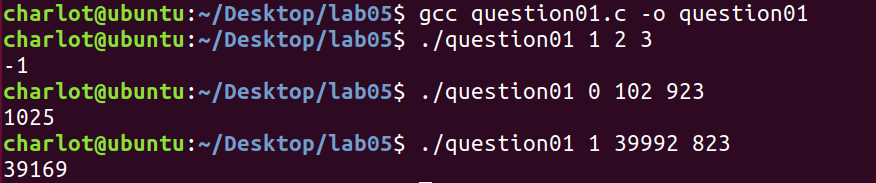
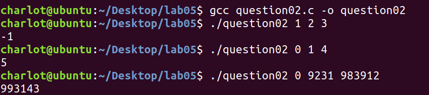
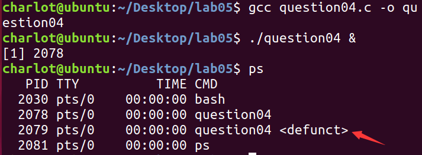
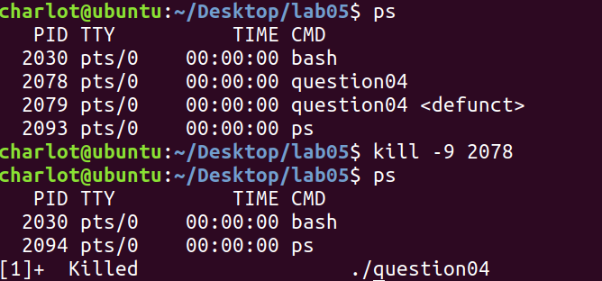
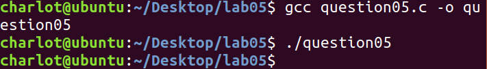
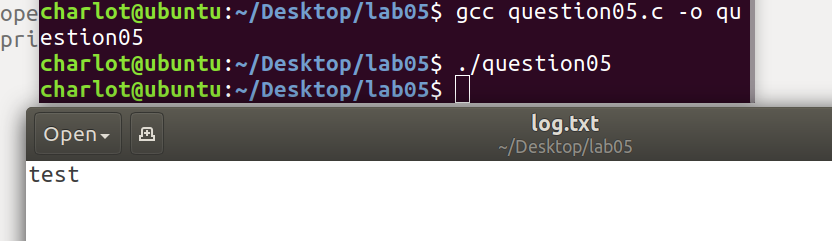
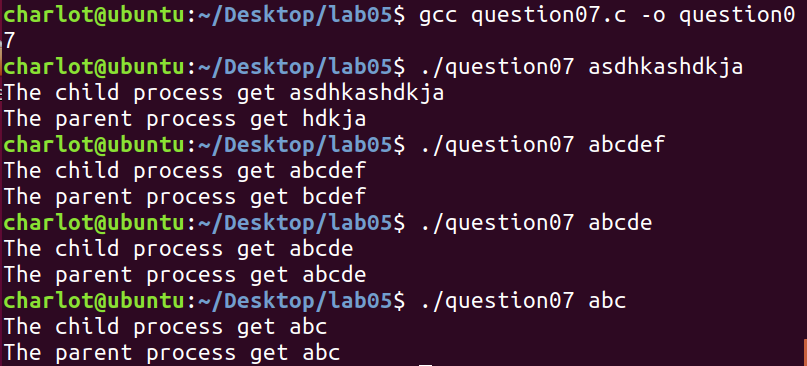

# Lab05 Assignment

> 班级：192112
> 学号：19373073
> 姓名：何潇龙

## 1. 参数传递

请写这样一个程序（不是函数）：传入三个参数，传入该程序的第一个参数用以判断该程序进行有理数算术加运算还是减运算（0 表示将要进行加运算，1 表示将要进行减运算），第二个第三个参数分别是加（减）运算的第一第二个元素。（提示：`main(int argc, char*argc[])`，可获取命令行参数）。

```c
#include <stdio.h>
#include <stdlib.h>
int main(int argc, char*argv[])
{
	if (atoi(argv[1])==1)
	{
		printf("%d\n",atoi(argv[2])-atoi(argv[3]));
	}
	else if (atoi(argv[1])==0)
	{
		printf("%d\n",atoi(argv[2])+atoi(argv[3]));
	}
	else
	{
		printf("Operation not exist\n");
	}	
	return 0;
}
```

执行结果：



## 2. 进程调用

请写这样一个程序：使用创建子进程的方式调用上一个程序，进行加运算和减运算（请学习`fork`和`exec`函数的使用）。

```c
#include <stdio.h>
#include <stdlib.h>
#include <unistd.h>
int main(int argc, char*argv[])
{
		execv("./question01",argv);
}
```

执行结果：



## 3. 守护进程

守护进程有哪些特点，创建一个守护进程需要哪些步骤，每一步的意义是什么？（如果没有这一步可能有什么问题）

**特点**：脱离终端并且在后台运行。

**过程**：

1. 创建子进程
2. 让子进程脱离控制终端（让进程摆脱原会话、原进程组、原控制终端的控制）
3. 改变当前目录为根目录（避免因为当前目录所在的文件系统不能卸载而对以后的使用造成诸多麻烦）
4. 修改文件权限掩码（取消子进程对文件操作的控制，大大增加该守护进程的灵活性）
5. 关闭文件描述符（防止被打开的文件描述符耗费系统资源、导致文件系统无法卸载）

## 4. 僵尸进程

僵尸进程有什么危害？编写一个会产生僵尸进程的程序并运行，在终端查看当前进程。然后利用终端杀死该进程。

僵尸进程存在于系统的任务列表中，在进程表中仍占了一个位置。会占用系统资源，如果很多，则会严重影响服务器的性能；

会产生僵尸进程的程序

```c
#include <stdio.h>
#include <unistd.h>
#include <stdlib.h>
void parent_code(int delay){
	sleep(delay);
}
int main(int argc, char*argv[])
{
	pid_t pid;
	int status;
	pid=fork();
	if(pid==0);
	if(pid>0) parent_code(100000);
}
```

查看状态：



僵尸进程用kill命令是无法杀掉的，但是我们可以结果掉僵尸进程的父进程，僵尸进程就成了孤儿进程，孤儿进程不会占用系统资源，会被init程序收养，然后init程序将其回收。



## 5. C 实现重定向

编写一个 C 程序：使得调用 `printf()` 时，输出直接重定向至 `log.txt`。

```c
#include <stdio.h>
#include <unistd.h>
#include <stdlib.h>
#include <fcntl.h>

int main(int argc, char*argv[])
{
	close(1);
	open("log.txt",O_RDWR);
	printf("test");
}
```

截图：



控制台没有输出信息，但此时```log.txt```里的内容发生了改变



## 6. 重定向代码分析

有以下一段代码：

```c
int fd1, fd2, fd3, fd4;
fd1 = open("a.txt", O_RDONLY);
fd2 = open("b.txt", O_WRONLY);
fd3 = dup(fd1);
fd4 = dup2(fd2, 0);
```

请问，最后的 fd1, fd2, fd3, fd4 的值为多少？并解释原因。

```c
fd1 =3 
//open一个文件的时候会返回一个新的描述符，这个描述一定是当前可用文件描述符中的最小值。当前0、1、2（标准输入、标准输出、标准错误）均已被使用了，因此fd1=3
fd2 =4
//和fd1同理,因为0，1，2，3都使用过了，因此得到4
fd3 =5
//dup函数使用时会返回一个新的描述符，这个描述一定是当前可用文件描述符中的最小值。因此fd3用的是当前未用过的最小的5
fd4 =0
//int dup2(int fd, int fd2);可以用fd2指定新描述符的值，如果fd2本身已经打开了，则会先将其关闭。如果fd等于fd2，则返回fd2，并不关闭它。此时fd2（0）本身已经打开了，所以它被关闭。此时再分配描述符，最小值就变成了0，因此fd4得到的文件描述符是0
```

### 7. 管道

编写 C 语言程序实现如下功能：创建父子进程，父子进程之间通过管道进行通信，父进程向子进程发送字符串，子进程接收到该字符串后，将该字符串的最后 5 个字符发送给父进程。

```c
#include <stdio.h>
#include <unistd.h>
#include <stdlib.h>
#include <fcntl.h>
#include <string.h>
#include <sys/types.h>
#include <sys/wait.h>
char sendbuf[200];
char recbuf[200];
char parrecbuf[200];
char *lastchars(char *str1){
	if(str1==NULL) return NULL;
	return (strlen(str1)>=5)?(str1+strlen(str1)-5):str1;//传进来的字符串长度小于5时返回原字符串
}
int main(int argc, char*argv[])
{
	int mypipe[2],fd;
	strcpy(sendbuf,argv[1]);
	if(pipe(mypipe)<0){
		perror("pipe failed");
		exit(0);
	} 
	if((fd=fork())<0){
		perror("fork failed");
		exit(0);
	}
	
	if(fd>0){
		write(mypipe[1],sendbuf,strlen(sendbuf));
		sleep(2);
		read(mypipe[0],parrecbuf,strlen(sendbuf));
		printf("The parent process get %s\n",parrecbuf);
		int *status;
		wait(status);
	}
	if(fd==0){
		sleep(1);
		read(mypipe[0],recbuf,strlen(sendbuf));
		printf("The child process get %s\n",recbuf);
		strcpy(recbuf,lastchars(recbuf));
		write(mypipe[1],recbuf,strlen(recbuf));
	}
}
```

执行结果：



### 8. 实验感想

这次实验对进程、重定向、还有管道的理解加深了一层。同时实验里的很多题目其实都是书上实例代码的改变，说明好好看书还是很重要的！

