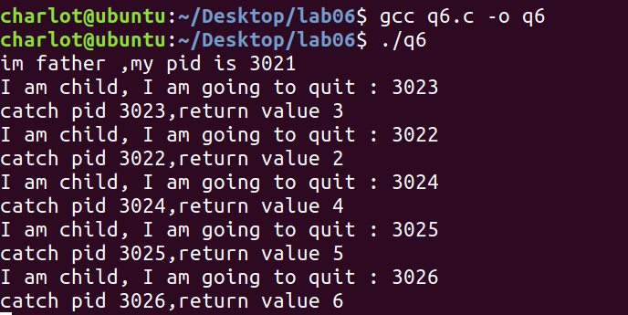

# Lab06 Assignment

> 班级：192112
> 学号：19373073
> 姓名：何潇龙

1. 请简述信号什么时候处于未决状态，并简述信号存在未决状态的作用。

   ```
   信号产生和递送之间的时间间隔内称信号是未决的。未决状态信号的产生主要是因为进程对此信号的阻塞，信号的未决状态使信号不会丢失。
   ```
   
   
   
2. 若在某信号的信号处理函数中给自己发送同一个信号，请简单描述程序的行为。

   ```
   接收到该信号的时候会调用信号处理函数，信号处理函数再次发送该信号，则再次调用信号处理函数，如此陷入死循环。下面是一个示例的代码：
   ```

   ```c
   #include<stdio.h>
   #include<sys/wait.h>
   #include<sys/types.h>
   #include<unistd.h>
   #include<signal.h>
   int i=0;
   void sigHandler(int signalNum)
   {
   	printf("%d\n",i++);
   	fflush(stdout);
       signal(SIGINT,sigHandler);
   	raise(SIGINT);
   }
   
   int main(){
   	signal(SIGINT,sigHandler);
   	fflush(stdout);
   	raise(SIGINT);
   }
   ```

   执行这段代码，发现程序一直在输出```i```：

   

3. 编写程序实现如下功能：程序 A.c 通过sigqueue()函数按用户输入向程序 B.c 发送信号和附加数据；B.c 程序接收到该信号后，输出伴随信号的附加数据。运行过程如下：

   > ./B & 							          //此时，输出进程B的PID号。
   >
   > ./A processB_PID sigvalue  //第一个参数表示进程B的PID，第二个参数为伴随信号的附加数据(int值即可)。

   ```c
   //code of A
   #include<stdio.h>
   #include<sys/wait.h>
   #include<sys/types.h>
   #include<unistd.h>
   #include<signal.h>
   # include <stdlib.h>
   int main(int argc ,char *argv[]){
   	int i,j,flag=1;
   	fflush(stdout);
   	union sigval sig={atoi(argv[2])};
   	sigqueue(atoi(argv[1]),SIGQUIT,sig);
   }
   ```

   ```c
   //code of B
   #include<stdio.h>
   #include<sys/wait.h>
   #include<sys/types.h>
   #include<unistd.h>
   #include<signal.h>
   #include<string.h>
   #include<stdlib.h>
   void sigHandler(int sig, siginfo_t *info, void *ucontext)
   {
   	printf("%d\n",info->si_value.sival_int);
   	fflush(stdout);
   }
   int main(int argc ,char *argv[]){
   	struct sigaction act;
   	act.sa_sigaction=sigHandler;
   	act.sa_flags=SA_SIGINFO;
   	sigaction(SIGQUIT,&act,NULL);
   	fflush(stdout);
   	while(1);
   }
   ```

   截图：

   

4. 请实现这样一个程序：程序每间隔1秒输出你的学号，当按下ctrl+c后，程序询问是否退出程序（此时停止输出学号），输入Y或5秒未进行任何输入则退出程序，输入N程序恢复运行，继续输出学号（提示：alarm()函数设置超时时间，SIGALRM信号处理函数作为超时处理）。

   ```c
   #include<stdio.h>
   #include<sys/wait.h>
   #include<sys/types.h>
   #include<unistd.h>
   #include<sys/time.h>
   #include<signal.h>
   #include <stdlib.h>
   void alarmHandler(int signalNum)
   {
   	exit(0);
   }
   void sigHandler(int signalNum)
   {
   	char c[10];
   	printf("是否退出程序(Y:退出,N:继续)\n");
   	alarm(5);
   	signal(SIGALRM,alarmHandler);
   	scanf("%s",c);
   	if(c[0]=='Y') exit(0);
   	else if(c[0]=='N'){
   		alarm(0);
   		return;
   	}
   }
   
   int main(){
   	signal(SIGINT,sigHandler);
   	while(1){
   		printf("19373073\n");
   		sleep(1);
   	}
   }
   ```

   截图：

   

5. 请实现这样一个程序：在程序中创建一个子进程，通过信号实现父子进程交替输出，父进程输出学号，子进程输出姓名，要求父进程先输出。

   ```c
   //code
   #include<stdio.h>
   #include<sys/wait.h>
   #include<sys/types.h>
   #include<unistd.h>
   #include<sys/time.h>
   #include<signal.h>
   #include <stdlib.h>
   pid_t father,child;
   void childHandler(int signalNum)
   {
   	printf("何潇龙\n");
   	kill(father,SIGRTMIN);
   	sleep(1);
   }
   void fatherHandler(int signalNum)
   {
   	printf("19373073\n");
   	kill(child,SIGRTMAX);
   	sleep(1);
   }
   
   int main(){
   	father=getpid();
   	signal(SIGRTMIN,fatherHandler);
   	signal(SIGRTMAX,childHandler);
   	if((child=fork())==0){
   		while(1);
   	}
   	else{
   		raise(SIGRTMIN);
   		while(1);
   	}
   }
   ```

   截图：

   

6. 父进程等待子进程退出通常仅需调用wait()函数，但如果子进程未退出，父进程将会一直处于阻塞态,并通过循环不断获取子进程状态，该回收子进程的方式是对CPU资源的浪费。子进程终止时会自动向父进程发送SIGCHLD信号，请通过该特性实现这样一个程序：父进程创建5个子进程，每个子进程输出PID后以不同的状态值退出，父进程使用SIGCHLD信号实现异步回收子进程，每回收一个子进程就输出该子进程的PID和退出状态值，需要保证任何情况下所有子进程都能回收（提示：SIGCHLD是不可靠信号，不支持排队，考虑两个子进程同时结束的情况）。

   ```c
   //code
   #include<stdio.h>
   #include<stdlib.h>
   #include<signal.h>
   #include <unistd.h>
   #include <sys/types.h>  
   #include <sys/wait.h>
   void child_catch(int signalNumber) {
       //子进程状态发生改变时，内核对信号作处理的回调函数
       int w_status;
       pid_t w_pid;
       while ((w_pid = waitpid(-1, &w_status, WNOHANG)) != -1 && w_pid != 0) {
           if (WIFEXITED(w_status)) //判断子进程是否正常退出
           printf("catch pid %d,return value %d\n", w_pid, WEXITSTATUS(w_status)); //打印子进程PID和子进程返回值
       }
   }
   
   int main()
   {
   	int count=5,i;
   	//捕捉SIGCHLD信号
   	pid_t father=getpid();
   	sigset_t child_sigset;
   	sigemptyset(&child_sigset); //将child_sigset每一位都设置为0
   	sigaddset(&child_sigset, SIGCHLD); //添加SIGCHLD位
   	sigprocmask(SIG_BLOCK, &child_sigset, NULL); //完成父进程阻塞SIGCHLD的设置
   	for(i=0;i<count;i++){
   		if(fork()==0){
   			break;
   		}
   	}
   	if(getpid()!=father){
   		sleep(1);
   		printf("I am child, I am going to quit : %d\n", getpid());
   		//退出子进程
   		exit(getpid()%10);
   	}
   	else{
   		struct sigaction act; //信号回调函数使用的结构体
   		act.sa_handler = child_catch;
   		sigemptyset(&(act.sa_mask)); //设置执行信号回调函数时父进程的的信号屏蔽字
   		act.sa_flags = SA_SIGINFO;
   		sigaction(SIGCHLD, &act, NULL); //给SIGCHLD注册信号处理函数
   		//解除SIGCHLD信号的阻塞
   		sigprocmask(SIG_UNBLOCK, &child_sigset, NULL);
   		printf("im father ,my pid is %d\n", getpid());
   		while (1); //父进程堵塞，回收子进程
   	}
   }
   ```

   截图：

   

7. 异步信号安全函数(async-signal-safe function)是可以在信号处理函数中安全调用的函数，即一个函数在返回前被信号中断，并在信号处理函数中再次被调用，均可以得到正确结果。通常情况下，不可重入函数(non-reentrant function)都不是异步信号安全函数，都不应该在信号处理函数中调用。

   1. 请判断下面的函数是否是异步信号安全函数，如果是请说明理由，如果不是请给出一种可能发生问题的情况。

      ```c
      int tmp;
      void swap1(int* x, int* y)
      {
          tmp = *x;
          *x = *y;
          *y = tmp;
      }
      ```

      ```c
      void swap2(int* x, int* y)
      {
          int tmp;
          tmp = *x;
          *x = *y;
          *y = tmp;
      }
      ```

      ```
      swap1不是异步安全函数，因为tmp作为全局变量，若该函数的多个副本在运行，当信号处理函数返回的时候，恢复原先的执行序列，可能会导致信号处理函数中的操作覆盖了之前正常操作中的数据。
      swap2是异步安全函数，因为tmp是局部变量，存储位置在栈上。它除了使用自己栈上的变量以外不依赖于任何环境，就算该函数的多个副本在运行，由于它们使用的是分离的栈，所以不会互相干扰。
      ```

      

   2. 由于printf()函数使用全局缓冲区，因此它不是异步信号安全函数。为了避免可能发生的问题，其中一个解决方法是在调用printf()函数前阻塞所有信号，并在调用后恢复。请用上述思路补全代码，实现printf()的异步信号安全版本，无需实现格式化输出（提示：sigprocmask()函数可用于阻塞多个信号）。

      ```c
      //code
      #include<stdio.h>
      #include<stdlib.h>
      #include<signal.h>
      #include <unistd.h>
      #include <sys/types.h>  
      #include <sys/wait.h>
      //code
      void sig_handler(int signum,siginfo_t* info,void* myact){
      	printf("catch a signal");
      }
      
      void print_safe()
      {
      	int i;
      	//TODO:阻塞所有信号
      	struct sigaction act;
      	sigset_t newmask,oldmask;
      	sigfillset(&newmask);//将所有信号加入信号集
      	sigprocmask(SIG_BLOCK,&newmask,&oldmask);
      	act.sa_sigaction=sig_handler;
      	act.sa_flags=SA_SIGINFO;
      	for(i=1;i<=64;i++)
      		sigaction(i,&act,NULL);
          
      	printf("safe print!\n");
          
      	//TODO:恢复所有信号
      	sigprocmask(SIG_SETMASK,&oldmask,NULL);
      }
      int main(){
      	print_safe();
      }
      
      ```
      
      

### 实验感想

这次实验实在是捣鼓了很久，各种地方都出问题，也暴露出自己写代码的时候还不够小心。好好看书看文档很重要，然后网上的参考也挺有用的。
