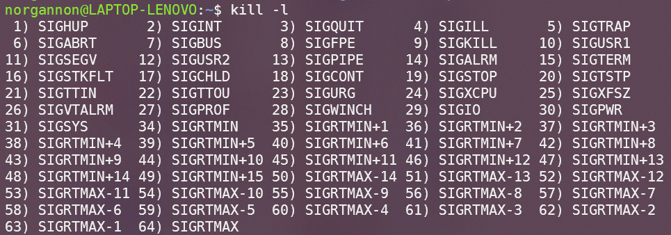

# lab06: 信号及信号处理

[TOC]

## 一、实验目的

1. 掌握信号基本概念。
2. 学习屏蔽、捕获信号的方法等与信号有关的基本操作。
3. 理解可重入函数、异步信号安全函数的概念。

## 二、实验内容

- 信号的含义
- 信号的分类

* 信号的产生
* 信号捕获
* 信号的屏蔽

## 三、实验指南

### 1.信号

**详见人民邮电出版社《Linux编程基础》第6章**

#### 1.1信号的含义

软中断信号(signal，又简称为信号)用来通知进程发生了异步事件。在软件层次上是对中断机制的一种模拟，在原理上，一个进程收到一个信号与处理器收到一个中断请求可以说是一样的。信号是进程间通信机制中唯一的异步通信机制，一个进程不必通过任何操作来等待信号的到达，事实上，进程也不知道信号到底什么时候到达。进程之间可 以互相通过系统调用kill发送软中断信号。内核也可以因为内部事件而给进程发送信号，通知进程发生了某个事件。信号机制除了基本通知功能外，还可以传递附加信息。

#### 1.2信号的分类

可以使用`kill -l`命令查看当前系统支持的所有信号：



信号值小于SIGRTMIN（<=34）的信号都是不可靠信号。它的主要问题是信号可能丢失。 信号值位于SIGRTMIN和SIGRTMAX之间的信号都是可靠信号，这些信号支持排队，不会丢失。

#### 1.3信号的产生

- 键盘事件：ctrl+c  ctrl+\  ctrl+Z等

- 非法内存：如果内存管理出错，系统就会发送一个信号进行处理

- 硬件检测到异常：如段错误，除0，总线错误等

- 环境切换：比如说从用户态切换到其他态，状态的改变也会发送一个信号，这个信号会告知给系统

- 系统调用：如调用`kill`，`raise`，`sigsend` ，`sigqueue`函数等，这些函数的使用具体请参见《Linux编程基础》的6.1节。

#### 1.4信号处理

进程可以通过三种方式响应信号：

- 接受默认处理
- 忽略信号（某些信号不能被忽略，如SIGKILL和SIGSTOP）
- 捕捉信号并执行信号处理程序

### 2.信号操作

#### 2.1信号的发送

- kill()函数

  系统调用中用于发送信号的函数有kill(),raise(),abort()等，其中kill()是最常用的函数，该函数用于给指定进程发送信号，该函数的声明如下：

  ```c
  #include <signal.h>
  
  int kill(pid_t pid, int sig);
  //第一个参数pid代表接受信号的进程PID，第二个参数代表要发送的信号
  ```

  参数pid会影响kill()函数的作用，取值分为以下四种情况

  1. 若pid>0，则发送信号sig给进程号为pid的进程。

  2. 若pid=0，则发送信号sig给当前进程所属进程组的所有进程。

  3. 若pid=-1，则发送信号sig给除1号进程和当前进程外的所有进程。

  4. 若pid<-1，则发送信号sig给属于进程组pid的所有进程。

     

- sigqueue()函数

  sigqueue()函数同样用于发送信号，与kill()不同的是，sigqueue()函数支持发送信号的同时传递参数，需要配合sigaction()函数一起使用。sigqueue()函数的声明如下：

  ```c
  #include <signal.h>
  
  int sigqueue(pid_t pid, int sig, const union sigval value);
  //第一个参数pid代表接受信号的进程PID，第二个参数代表要发送的信号，第三个参数用于指定传递的数据
  ```

  参数value用于指定伴随信号传递的数据，为sigval联合体，该联合体的定义如下：

  ```c
  union sigval {
  	int   sival_int;
  	void *sival_ptr;
  };
  ```

  

  如果进程需要接收信号和附加数据，定义信号处理函数时首先应该接收三个参数：

  ```c
  void handler(int sig, siginfo_t *info, void *ucontext)
  {
  	...
  }
  //第一个参数sig代表接收信号的值
  //第二个参数info是指向siginfo_t类型的指针，包含了有关信号的附加信息
  //第三个参数ucontext是内核保存在用户空间的信号上下文，一般不使用该参数
  ```

  此时如果接收进程使用sigaction()注册信号处理函数，并将sa_flags字段置为SA_SIGINFO，那么在信号处理函数中可以通过info参数的`si_value`获取到发送信号伴随的数据，如`info->si_value.sival_int`或`info->si_value.sival_ptr`。


​       具体可以参考https://man7.org/linux/man-pages/man3/sigqueue.3.html 和 https://man7.org/linux/man-pages/man2/sigaction.2.html。

#### 2.2信号的捕捉

若进程捕捉某信号后，想要让其执行非默认的处理函数，则需要为该信号注册信号处理函数。进程的信号是在内核态下处理的，内核为每个进程准备了一个信号向量表，其中记录了每个信号所对应的信号处理函数。Linux系统为用户提供了两个捕捉信号的函数，即signal()和sigaction()两个函数。

```c
#include <signal.h>

typedef void (*sighandler_t)(int);
sighandler_t signal(int signum,sighandler_t handler);

//第一个参数表示信号编号，第二个参数一般表示信号处理函数的函数指针，除此之外还可以为SIG_IGN和SIG_DEL
```

```c
#include <signal.h>

int sigaction(int signum,const struct sigaction* act,const struct sigaction* oldact);

//第一个参数表示信号编号，第二个为传入参数，包含自定义处理函数和其他信息，第三个参数为传出参数，包含旧处理函数等信息
```

#### 2.3信号的屏蔽

信号屏蔽机制是用于解决常规信号不可靠这一问题。在进程的PCB中存在两个信号集，分别为信号掩码和未决信号集。两个信号集实质上都是位图，其中每一位对应一个信号，若信号掩码某一位为1，则其对应的信号会被屏蔽，进入阻塞状态，此时内核会修改未决信号集中该信号对应的位为1，表示信号处于未决状态，之后除非信号被解除屏蔽，否则内核不会再向该进程发送该信号。

信号集设定函数：

- sigemptyset()——将指定信号集清0

- sigfillset()——将指定信号集置1

- sigaddset()——将某信号加入指定信号集

- sigdelset()——将某信号从信号集中删除

- sigismember()——判断某信号是否已被加入指定信号集

  

信号集函数：

```c
#include <signal.h>

int sigprocmask(int how,const sigset_t* set,sigset_t* oldset);

//第一个参数用于设置位操作方式，第二个参数一般为用户指定信号集，第三个参数用于保存原信号集
//how=SIG_BLOCK：mask=mask|set
//how=SIG_UNBLOCK：mask=mask&~set
//how=SIG_SETMASK：mask=set
```

#### 2.4定时信号

Linux下的alarm()函数可以用来设置闹钟，该函数的原型为：

```c
#include<unistd.h>
unsigned int alarm(unsigned int seconds);
//第一个参数seconds用来指明时间，经过seconds秒后发送SIGALRM信号给当前进程，当参数为0则取消之前的闹钟
```

返回值：

- 如果本次调用前已有正在运行的闹钟，alarm()函数返回前一个闹钟的剩余秒数
- 如果本次调用前无正在运行的闹钟，alarm()函数返回0


Linux系统中sleep()函数内部使用nanosleep()函数实现，该函数与信号无关；而其他系统中可能使用alarm()和pause()函数实现，此时不应该混用alarm()和sleep()。

#### 2.5计时器

Linux下的setitimer()和getitimer()系统调用可以用于访问和设置计时器，计时器在初次经过设定的时间后发出信号，也可以设置为每间隔相同的时间发出信号，该函数的原型为：

```c
#include <sys/time.h>

int getitimer(int which, struct itimerval *curr_value);
int setitimer(int which, const struct itimerval *restrict new_value,
                     struct itimerval *restrict old_value);
```

通过指定which参数，可以设置不同的计时器，不同的计时器触发后也会发出不同的信号，一个进程同时只能有一种计时器：

- ITIMER_REAL：真实计时器，计算程序运行的真实时间（墙钟时间），产生SIGALRM信号
- ITIMER_VIRTUAL：虚拟计时器，计算当前进程处于用户态的cpu时间，产生SIGVTALRM信号
- ITIMER_PROF：实用计时器，计算当前进程处于用户态和内核态的cpu时间，产生SIGPROF信号

计时器的值有以下结构体定义：

```c
struct itimerval { 
	struct timeval it_interval; //定期触发的间隔
	struct timeval it_value; //初次触发时间
}; 

struct timeval { 
	time_t tv_sec; //秒
	suseconds_t tv_usec; //微秒
};
```

若new_value.it_value的两个字段不全为0，则定时器初次将会在设定的时间后触发；若new_value.it_value的两个字段全为0，则计时器不工作。

若new_value.it_interval的两个字段不全为0，则定时器将会在初次触发后按设定的时间间隔触发；若new_value.it_interval的两个字段全为0，则计时器仅初次触发一次。


setitimer()函数和alarm()函数共享同一个计时器，因此不应同时使用。

## 四、实验习题

1. 请简述信号什么时候处于未决状态，并简述信号存在未决状态的作用。

2. 若在某信号的信号处理函数中给自己发送同一个信号，请简单描述程序的行为。

3. 编写程序实现如下功能：程序 A.c 通过sigqueue()函数按用户输入向程序 B.c 发送信号和附加数据；B.c 程序接收到该信号后，输出伴随信号的附加数据。运行过程如下：

   > ./B & 							          //此时，输出进程B的PID号。
   >
   > ./A processB_PID sigvalue  //第一个参数表示进程B的PID，第二个参数为伴随信号的附加数据(int值即可)。

4. 请实现这样一个程序：程序每间隔1秒输出你的学号，当按下ctrl+c后，程序询问是否退出程序（此时停止输出学号），输入Y或5秒未进行任何输入则退出程序，输入N程序恢复运行，继续输出学号（提示：alarm()函数设置超时时间，SIGALRM信号处理函数作为超时处理）。

5. 请实现这样一个程序：在程序中创建一个子进程，通过信号实现父子进程交替输出，父进程输出学号，子进程输出姓名，要求父进程先输出。

6. 父进程等待子进程退出通常仅需调用wait()函数，但如果子进程未退出，父进程将会一直处于阻塞态,并通过循环不断获取子进程状态，该回收子进程的方式是对CPU资源的浪费。子进程终止时会自动向父进程发送SIGCHLD信号，请通过该特性实现这样一个程序：父进程创建5个子进程，每个子进程输出PID后以不同的状态值退出，父进程使用SIGCHLD信号实现异步回收子进程，每回收一个子进程就输出该子进程的PID和退出状态值，需要保证任何情况下所有子进程都能回收（提示：SIGCHLD是不可靠信号，不支持排队，考虑两个子进程同时结束的情况）。

7. 异步信号安全函数(async-signal-safe function)是可以在信号处理函数中安全调用的函数，即一个函数在返回前被信号中断，并在信号处理函数中再次被调用，均可以得到正确结果。通常情况下，不可重入函数(non-reentrant function)都不是异步信号安全函数，都不应该在信号处理函数中调用。

   1. 请判断下面的函数是否是异步信号安全函数，如果是请说明理由，如果不是请给出一种可能发生问题的情况。

      ```c
      int tmp;
      void swap1(int* x, int* y)
      {
          tmp = *x;
          *x = *y;
          *y = tmp;
      }
      ```

      ```c
      void swap2(int* x, int* y)
      {
          int tmp;
          tmp = *x;
          *x = *y;
          *y = tmp;
      }
      ```

      

   2. 由于printf()函数使用全局缓冲区，因此它不是异步信号安全函数。为了避免可能发生的问题，其中一个解决方法是在调用printf()函数前阻塞所有信号，并在调用后恢复。请用上述思路补全代码，实现printf()的异步信号安全版本，无需实现格式化输出（提示：sigprocmask()函数可用于阻塞多个信号）。
   
      ```c
      void print_safe()
      {
          //TODO:阻塞所有信号
          printf("safe print!\n")
          //TODO:恢复所有信号
      }
      ```
   
      
