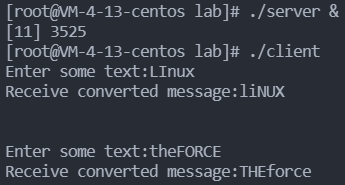
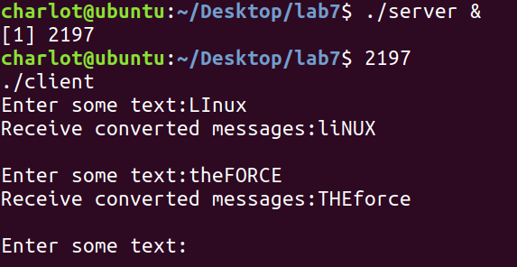
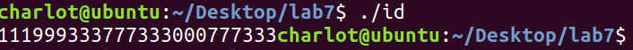
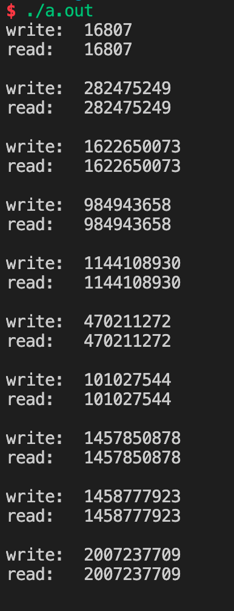
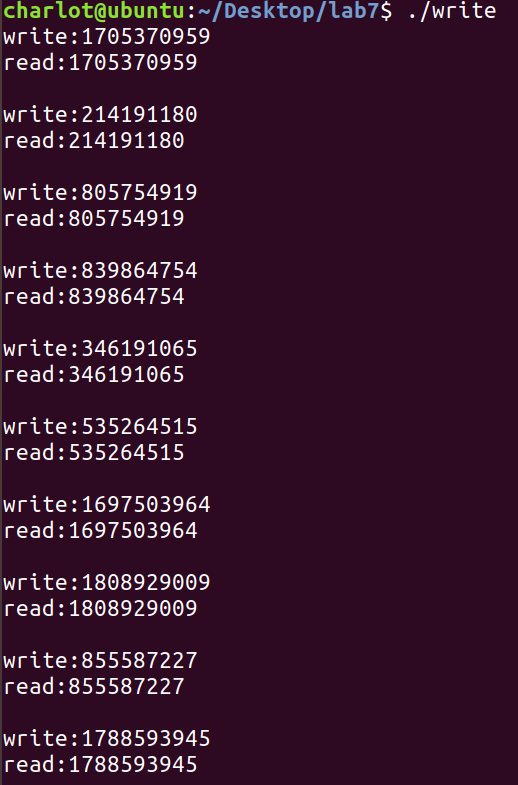

# Lab07 Assignment

> 班级：192112
> 学号：19373073
> 姓名：何潇龙

## 1. 请实现这样一个程序

请实现这样一个程序：客户端进程（Client）和服务器进程（Server）通过**消息队列**进行通信，消息队列共有两个，Up 和 Down，如下图所示：


客户端进程接受用户从终端的输入，并通过 Up 消息队列将消息传递给服务器进程，然后等待服务器进程从 Down 消息队列传回消息。服务器进程从 Up 接收到消息后将大小写字母转换，并通过 Down 传回给客户端进程，客户端随后输出转换后的消息。（例如：客户端通过 Up 发送'linuX', 将从 Down 接收到'LINUx'）。多个客户端同时使用 Up 和 Down 消息队列时也应该能够正常工作，因此需要使用消息类型 mtype 区分来自不同客户端的消息。要求程序输出如下的效果：



```c
//code
//client.c
#include<fcntl.h>
#include<sys/msg.h>
#include<unistd.h>
#include<sys/types.h>
#include<signal.h>
#include<stdio.h>
#include<string.h>
#include<stdlib.h>
#include<ctype.h>
#include<math.h>
#define PATHNAME "."

char s[1000];
struct msgbuf{
    long mtype;
    char mtext[512];
};
int main(){
    int msgid_down,msgid_up,i,n;
    long type;
    key_t _key1=ftok(PATHNAME,1);
	key_t _key2=ftok(PATHNAME,2);
    struct msgbuf my_data;
    msgid_up=msgget(_key1,IPC_CREAT|S_IRUSR|S_IWUSR);
    msgid_down=msgget(_key2,IPC_CREAT|S_IRUSR|S_IWUSR);
    type=1;
    while(1){
        printf("Enter some text:");
        scanf("%s",s);
        my_data.mtype=type;
        strcpy(my_data.mtext,s);
        msgsnd(msgid_up,&my_data,sizeof(my_data),0);
        sleep(1);
        msgrcv(msgid_down,&my_data,sizeof(struct msgbuf),type,0);
        printf("Receive converted messages:%s\n\n",my_data.mtext);
	}
    msgctl(msgid_up,IPC_RMID,NULL);
    msgctl(msgid_down,IPC_RMID,NULL);
    return 0;
}
//server.c 
#include<fcntl.h>
#include<sys/msg.h>
#include<unistd.h>
#include<sys/types.h>
#include<signal.h>
#include<stdio.h>
#include<string.h>
#include<stdlib.h>
#include<ctype.h>
#include<math.h>
#define PATHNAME "."

struct msgbuf{
    long mtype;
    char mtext[512];
};
int main(){
    int msgid_down,msgid_up,i,n;
    long type;
    struct msgbuf my_data;
    printf("%d\n",getpid());
    key_t _key1=ftok(PATHNAME,1);
	key_t _key2=ftok(PATHNAME,2);
    msgid_up=msgget(_key1,IPC_CREAT|S_IRUSR|S_IWUSR);
    msgid_down=msgget(_key2,IPC_CREAT|S_IRUSR|S_IWUSR);
    type=1;
    while(1){
        msgrcv(msgid_up,&my_data,sizeof(struct msgbuf),type,0);
        n=strlen(my_data.mtext);
        for(i=0;i<n;i++){
            if(isupper(my_data.mtext[i])){
            my_data.mtext[i]=tolower(my_data.mtext[i]);
    		}
   		 	else if(islower(my_data.mtext[i])){
       		my_data.mtext[i]=toupper(my_data.mtext[i]);
    		}
    	}
    	msgsnd(msgid_down,&my_data,sizeof(my_data),0);
    }
    msgctl(msgid_up,IPC_RMID,NULL);
    msgctl(msgid_down,IPC_RMID,NULL);
    return 0;
}
```

截图：



## 2. 请实现这样一个程序

请实现这样一个程序：一个进程创建 3 个子进程，每个子进程都打印你的学号，但要求每个进程都打印完这一位数字后，才能有进程开始下一位数字的打印。例如，我的学号是`18373455`，那么输出结果应该是`111888333777333444555555`。仅允许使用**信号量**作为同步工具。

```c
//code
#include<fcntl.h>
#include<unistd.h>
#include<sys/types.h>
#include<sys/ipc.h>
#include<sys/sem.h>
#include<signal.h>
#include<stdio.h>
#include<string.h>
#include<stdlib.h>
#include<ctype.h>
#include<math.h>
char s[20]={"19373073"};
struct sembuf op_v,op_p;
union semun arg1,arg2;
int sem_id1,sem_id2,sem_id3;
int pid1,pid2,pid3,n=8;
union semun{
    int val;
    struct semid_ds *buf;
    unsigned short *array;
};
void execute(int sem_ida,int sem_idb){
    int i=0;
    while(i<n){
        semop(sem_idb,&op_p,1);
        printf("%c",s[i++]);
        fflush(stdout);
        semop(sem_ida,&op_v,1);
    }
    semctl(sem_idb,0,IPC_RMID,arg2);
}
int main(){
    op_v.sem_num=0;
    op_v.sem_op=1;
    op_v.sem_flg=SEM_UNDO;
    op_p.sem_num=0;
    op_p.sem_op=-1;
    op_p.sem_flg=SEM_UNDO;
    arg1.val=1;
    arg2.val=0;
    sem_id1=semget(ftok(".",'1'),1,0777|IPC_CREAT);
    sem_id2=semget(ftok(".",'2'),1,0777|IPC_CREAT);
    sem_id3=semget(ftok(".",'3'),1,0777|IPC_CREAT);
    semctl(sem_id1,0,SETVAL,arg1);
    semctl(sem_id2,0,SETVAL,arg2);
    semctl(sem_id3,0,SETVAL,arg2);
    pid1=fork();
    if(pid1!=0){
        pid2=fork();
        if(pid2!=0){
            pid3=fork();
            if(pid3==0){
                execute(sem_id1,sem_id3);
    		}
            else{
                execute(sem_id3,sem_id2);
            }
    	}
        else{
            execute(sem_id2,sem_id1);
        }
    }
    return 0;
}
```

截图：



## 3. 请实现这样一个程序

在《Linux 编程基础》一书对共享内存的讲解中，其给出的例子是一个进程向共享内存写，然后终止，然后再启动一个进程从共享内存中读。请实现这样一个程序：同时使用**信号量**和**共享内存**实现一个这样的功能，同时运行两个进程，一个进程向共享内存中写入数据后阻塞，等待另一个进程读，再写，然后再读。要求程序输出如下的效果：



一共要求输出 10 组，30 行，`read`行之后有一空行，以便于明显区分组别；`write`和`read`后面的数字请不要显示明显的规律性，请使用`rand()`函数获取，并一定在调用`rand()`函数之前，使用`srand(unsigned int seed)`重置随机种子，其中，`seed`为你的学号。

```c
//code
//semlib.h
union semun{
    int val;
    struct semid_ds *buf;
    unsigned short *array;
};
int init_sem(int sem_id,int init_value);
int del_sem(int sem_id);
int sem_p(int sem_id);
int sem_v(int sem_id);
int init_sem(int sem_id,int init_value){
    union semun sem_union;
    sem_union.val=init_value;
    if(semctl(sem_id,0,SETVAL,sem_union)==-1) {
        perror("initializing semaphore");
        return -1;
    }
    return 0;
}
int del_sem(int sem_id){
    union semun sem_union;
    if(semctl(sem_id,0,IPC_RMID,sem_union)==-1){
        perror("Delete semaphore failed");
        return -1;
    }
}
int sem_p(int sem_id){
    struct sembuf sem_b;
    sem_b.sem_num=0;
    sem_b.sem_op= -1;
    sem_b.sem_flg=SEM_UNDO;
    if(semop(sem_id,&sem_b,1)==-1){
        perror("P operation failed");
        return -1;
    }
    return 0;
}
int sem_v(int sem_id){
    struct sembuf sem_b;
    sem_b.sem_num=0;
    sem_b.sem_op=1;
    sem_b.sem_flg=SEM_UNDO;
    if(semop(sem_id,&sem_b,1)==-1){
        perror("V operation failed");
        return -1;
    }
    return 0;
}
//write.c
#include <stdio.h>
#include <unistd.h>
#include <stdlib.h>
#include <sys/types.h>
#include <sys/ipc.h>
#include <sys/shm.h>
#include <sys/sem.h>
#include "semlib.h"
int main(){
    unsigned int seed=19373073;
    int shmid=0;
    int num=9;
    if((shmid=shmget(ftok(".",'a'),4096,IPC_CREAT|0666))<0){
        perror("shmget");
        exit(-1);
    }
    char *addr=shmat(shmid,NULL,0);
    int sem_id=semget(ftok(".",'b'),1,IPC_CREAT);
    srand(seed);
    int number=rand();
    *(int *)addr=number;
    printf("write:%d\n",number);
    sem_v(sem_id);
    while(num--){
        sem_p(sem_id);
        number=rand();
        *(int *)addr=number;
        printf("write:%d\n",number);
        sem_v(sem_id);
    }
    shmdt(addr);
    sleep(1);
    exit(0);
}
//read.c
#include <stdio.h>
#include <unistd.h>
#include <stdlib.h>
#include <string.h>
#include <sys/types.h>
#include <sys/ipc.h>
#include <sys/shm.h>
#include <sys/sem.h>
#include "semlib.h"
int main(){
    unsigned int seed=19373073;
    int shmid=0;
    int num=9;
    if((shmid=shmget(ftok(".",'a'),4096,IPC_CREAT|0666))<0){
        perror("shmget");
        exit(-1);
    }
    char *addr=shmat(shmid,NULL,0);
    int sem_id=semget(ftok(".",'b'),1,IPC_CREAT|0666);
    while(num--){
        sem_p(sem_id);
        printf("read:%d\n",*(int *)addr);
        memset(addr,0,4096);
        printf("\n");
        sem_v(sem_id);
    }
    sem_p(sem_id);
    printf("read:%d\n",*(int *)addr);
    memset(addr,0,4096);
    printf("\n");
    shmdt(addr);
    shmctl(shmid,IPC_RMID,NULL);
    del_sem(sem_id);
    exit(0);
}
```

截图：



## 4. 实验感想

这一部分函数实在是太多了...要好好复习，希望之后能熟练掌握。
