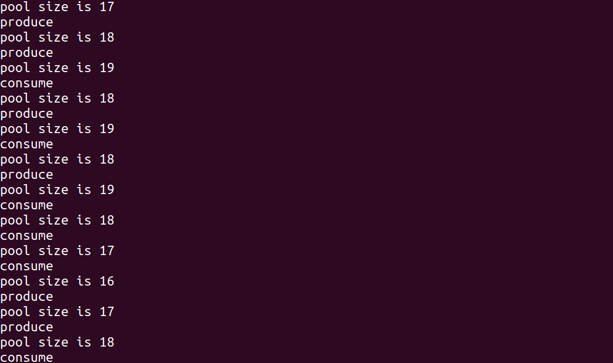

# Lab08 Assignment

> 班级：192112
> 学号：19373073
> 姓名：何潇龙

## 1. 创建一个线程，分别打印该线程和原来的线程的进程号和父进程号，然后回收刚刚创建的线程。

```c
//code
#include <stdio.h>
#include <stdlib.h>
#include<fcntl.h>
#include<signal.h>
#include<unistd.h>
#include<sys/types.h>
#include <pthread.h>
void *create(){
    printf("I'm child, my pid is:%ld\n",pthread_self());
    fflush(stdout);
    pthread_exit(NULL);
}
int main(){
    pthread_t tid;
    int error;
    printf("In main, my pid is:%ld\n",pthread_self());
    error=pthread_create(&tid,NULL,create,NULL);
    sleep(3);
    return 0;
}
```

截图：


## 2. 仅使用锁来实现两个线程的同步，让线程a不断地为公共变量Num增加1，而当Num增加至100时线程b将Num归0，不断重复上述过程。**将Num输出到屏幕并给出代码和操作步骤。**

```c
//code
#include <stdio.h>
#include <stdlib.h>
#include <unistd.h>
#include <pthread.h>
int num;
pthread_mutex_t mutex;
void *t1(){
    while(1){
        pthread_mutex_lock(&mutex);
        printf("%d\n",num++);
        fflush(stdout);
        pthread_mutex_unlock(&mutex);
        usleep(10);
    }
}
void *t2(){
    while(1){
        pthread_mutex_lock(&mutex);
        if(num==100){
            num=0;
        }
        pthread_mutex_unlock(&mutex);
    }
}
int main(){
    pthread_t id1,id2;
    int error;
    pthread_mutex_init(&mutex,NULL);
    pthread_create(&id1,NULL,t1,NULL);
    pthread_create(&id2,NULL,t2,NULL);
    sleep(1000);
    return 0;
}

```

截图：


## 3. 在实际过程中，条件变量和互斥锁总是结合使用，因为互斥锁只能表示锁与不锁两种状态，而仅靠条件变量本身也是无法实现线程同步的。条件变量允许线程以无竞争的方式进行等待直到某条件发生，而不是总是尝试去获取锁。使用条件变量和锁重写上一问题，**给出代码和操作步骤**。

```c
//code
#include <stdio.h>
#include <stdlib.h>
#include <unistd.h>
#include <pthread.h>
int num;
pthread_mutex_t mutex;
pthread_cond_t cond;
void *t1(){
    while(1){
        pthread_mutex_lock(&mutex);
        if(num!=100){
            pthread_cond_wait(&cond,&mutex);
        }
        if(num==100){
            num=0;
        }
        pthread_mutex_unlock(&mutex);
        usleep(10);
    }
}
void *t2(){
    while(1){
        pthread_mutex_lock(&mutex);
        if(num==100){
            pthread_cond_signal(&cond);
        }
        else{
            printf("%d\n",num++);
        }
        pthread_mutex_unlock(&mutex);
    }
}
int main(){
    pthread_t id1,id2;
    int error;
    pthread_mutex_init(&mutex,NULL);
    pthread_cond_init(&cond,NULL);
    pthread_create(&id1,NULL,t1,NULL);
    pthread_create(&id2,NULL,t2,NULL);
    sleep(1000);
    pthread_mutex_destroy(&mutex);
    pthread_cond_destroy(&cond);
    return 0;
}
```

截图：


## 4. 在一个程序中创建8个线程，每个线程打印你的学号中的一位数字，按照学号顺序打印出来。**不要使用`sleep`来进行同步，给出代码和操作步骤**。

```c
//code
#include<fcntl.h>
#include<unistd.h>
#include<sys/types.h>
#include<signal.h>
#include<stdio.h>
#include<string.h>
#include<stdlib.h>
#include<ctype.h>
#include<pthread.h>
#include<semaphore.h>
int num;
char s[10]={"019373073"};
const char *name[]={"0","1","2","3","4","5","6","7","8","9"};
sem_t *sems[10];
void *t0(){
    sem_wait(sems[3]);
    printf("%c",s[3]);
    fflush(stdout);
    sem_post(sems[4]);
}
void *t1(){
    sem_wait(sems[1]);
    printf("%c",s[1]);
    fflush(stdout);
    sem_post(sems[2]);
}
void *t2(){
    sem_wait(sems[2]);
    printf("%c",s[2]);
    fflush(stdout);
    sem_post(sems[3]);
}
void *t3(){
    sem_wait(sems[3]);
    printf("%c",s[3]);
    fflush(stdout);
    sem_post(sems[4]);
}
void *t4(){
    sem_wait(sems[4]);
    printf("%c",s[4]);
    fflush(stdout);
    sem_post(sems[5]);
}
void *t5(){
    sem_wait(sems[5]);
    printf("%c",s[5]);
    fflush(stdout);
    sem_post(sems[6]);
}
void *t6(){
    sem_wait(sems[6]);
    printf("%c",s[6]);
    fflush(stdout);
    sem_post(sems[7]);
}
void *t7(){
    sem_wait(sems[7]);
    printf("%c",s[7]);
    fflush(stdout);
    sem_post(sems[8]);
}
void *t8(){
    sem_wait(sems[8]);
    printf("%c",s[8]);
    fflush(stdout);
}
void *(*fun_array[9]) () = {t0,t1,t2,t3,t4,t5,t6,t7,t8};
int main(){
    pthread_t id[9];
    int error;
    int i;
    sems[1] = sem_open("1",O_CREAT,0777,1);
   
	for(i=2;i<=9;i++){
        sems[i]=sem_open(name[i],O_CREAT,0777,0);
    }
    for(i=1;i<=8;i++){
     pthread_create(&id[i],NULL,fun_array[i],NULL);
    }   

    sleep(1);
    puts("");
    for(i=1;i<=9;i++){
        sem_close(sems[i]);
    }
    for(i=1;i<=9;i++){
        sem_unlink(name[i]);
    }
    return 0;
}
```

截图：


**本题目你采取的同步策略是什么，为什么采用这样的策略，这是最好的同步策略吗？**

```
//ans
采用的同步策略是信号量，按照学号的个数，先给除了第一个之外的所有的信号量初始化为0，第一个信号量为1，在执行的时候，每一个线程执行完，就将下一位对应的信号量进行V操作。采取这样的策略是因为信号量之间的同步比较简明易懂。不一定是最好的同步策略。
```

## 5.假设缓冲区上限为20，生产者和消费者线程各10个，请编写程序实现一个生产者消费者模型。**在每次生产、消费时将当前动作类型（produce/consume）与缓冲区内容量输出到屏幕，给出代码和操作步骤。**

生产者消费者问题（Producer-consumer problem），也称有限缓冲问题（Bounded-buffer problem），是一个多线程同步问题的经典案例。该问题描述了共享固定大小缓冲区的两个线程——即所谓的“生产者”和“消费者”——在实际运行时会发生的问题。生产者的主要作用是生成一定量的数据放到缓冲区中，然后重复此过程。与此同时，消费者也在缓冲区消耗这些数据。该问题的关键就是要保证生产者不会在缓冲区满时加入数据，消费者也不会在缓冲区中空时消耗数据。

生产者消费者问题主要要注意以下三点：

- 在缓冲区为空时，消费者不能再进行消费
- 在缓冲区为满时，生产者不能再进行生产
- 在一个线程进行生产或消费时，其余线程不能再进行生产或消费等操作，即保持线程间的同步

```c
//code
#include<stdio.h>
#include<stdlib.h>
#include<unistd.h>
#include<pthread.h>
#include<semaphore.h>
#define PRODUCER_NUM 10
#define CONSUMER_NUM 10
#define POOL_SIZE 20
int pool[POOL_SIZE];
int head=0;
int rear=0;
sem_t room_sem;
sem_t product_sem;
pthread_mutex_t mutex;
void *producer_fun(){
    while (1){
        sleep(1);
        sem_wait(&room_sem);
        pthread_mutex_lock(&mutex);
        pool[rear]=1;
        rear=(rear+1)%POOL_SIZE;
        printf("produce\n");
        printf("pool size is %d\n",(rear-head+POOL_SIZE)%POOL_SIZE);
        pthread_mutex_unlock(&mutex);
        sem_post(&product_sem);
    }
}
void *consumer_fun(){
    while (1){
        int data;
        sleep(2);
        sem_wait(&product_sem);
        pthread_mutex_lock(&mutex);
        data=pool[head];
        head=(head+1)%POOL_SIZE;
        printf("consume\n");
        printf("pool size is %d\n",(rear-head+POOL_SIZE)%POOL_SIZE);
        pthread_mutex_unlock(&mutex);
        sem_post(&room_sem);
    }
}
int main(){
    int i;
    int number[10]={1,2,3,4,5,6,7,8,9,10};
    pthread_t producer_id[PRODUCER_NUM];
    pthread_t consumer_id[CONSUMER_NUM];
    pthread_mutex_init(&mutex,NULL);
    sem_init(&room_sem,0,POOL_SIZE-1);
    sem_init(&product_sem,0,0);
    for(i=0;i<PRODUCER_NUM;i++){
        pthread_create(&producer_id[i],NULL,producer_fun,NULL);
        pthread_create(&consumer_id[i],NULL,consumer_fun,NULL);
    }
    for(int i=0;i<PRODUCER_NUM;i++){
        pthread_join(producer_id[i],NULL);
        pthread_join(consumer_id[i],NULL);
    }
    exit(0);
}
```

截图：

