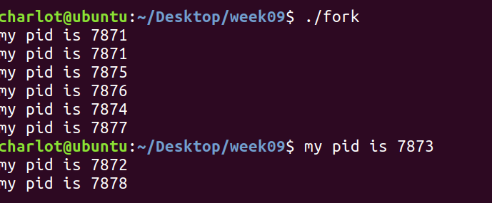
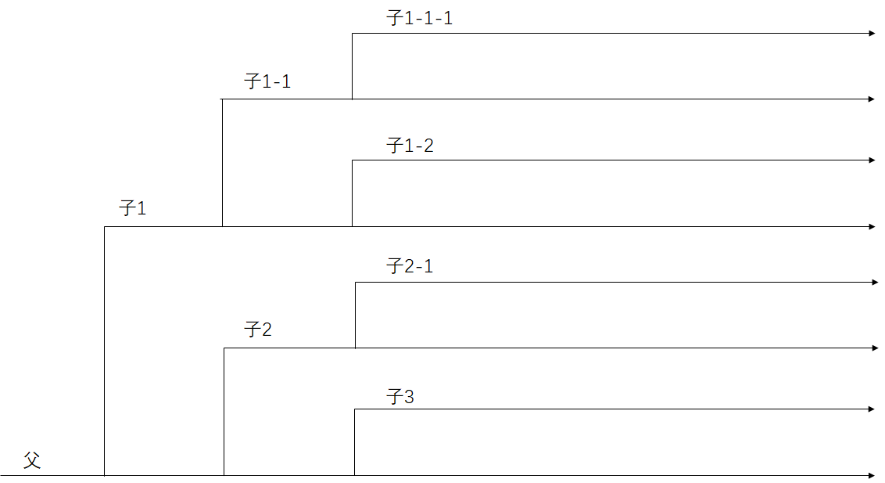
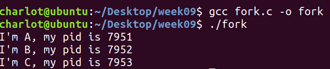
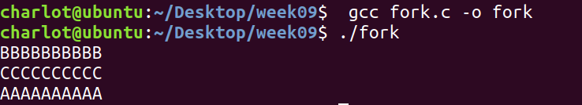

# Week09 Assignment

> 班级：192112
> 学号：19373073
> 姓名：何潇龙

## 1. 请给出下列代码输出行数，并解释原因

```c
#include<stdio.h>
#include<unistd.h>
int main(){
    printf("my pid is %d\n", getpid());
    fork();
    fork();
    fork();
    printf("my pid is %d\n", getpid());
}
```

9行。第一行`printf("my pid is %d\n", getpid());`会被父进程执行一遍，接下来三次fork将一个进程复制成了总共8（$2^3$)个进程，八个进程都执行最后一次的`printf("my pid is %d\n", getpid());`



## 2. 画出上述进程的创建过程



## 3. 编写一个程序，实现下图示的进程之间的关系

进程 A -> 进程 B -> 进程 C

其中箭头的方向表明它们之间的生成关系，即 A 是祖先进程，C 是孙子进程。

```c
#include<stdio.h>
#include<unistd.h>
int main(){
	printf("I'm A, my pid is %d\n", getpid());
	if(fork()==0)
	{
		printf("I'm B, my pid is %d\n", getpid());
		if(fork()==0)
		{
			printf("I'm C, my pid is %d\n", getpid());
		}
	}
}
```

执行结果：



## 4. 编写一个程序，创建两个子进程，父进程在屏幕上输出 10 个字符 'A'，两个子进程分别输出 10 个 'B' 和 'C'

> 要求父进程在两个子进程输出完字符后再输出自己的字符。

```c
#include<stdio.h>
#include<sys/wait.h>
#include<sys/types.h>
#include<unistd.h>
int main(){
	if(fork()==0)
	{
		printf("BBBBBBBBBB\n");
		if(fork()==0)
		{
			printf("CCCCCCCCCC\n");
		}
	}
	else
	{
		int* status;
		waitpid(-1,status,0);
		printf("AAAAAAAAAA\n");
	}
}
```



