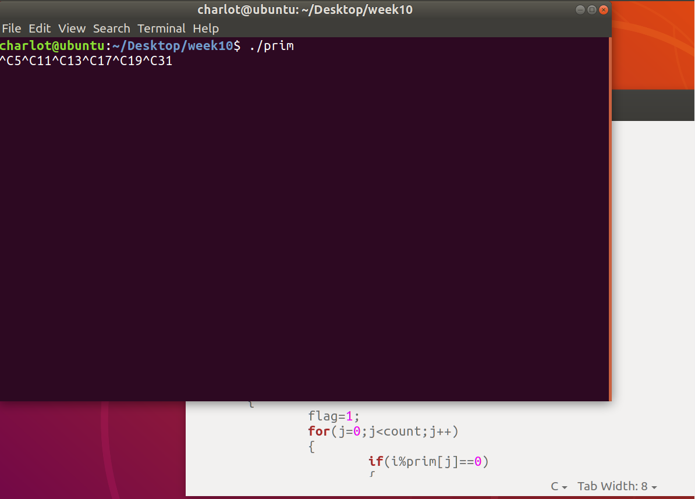
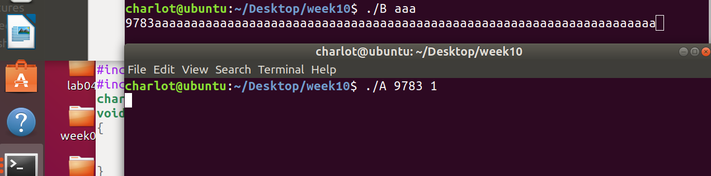

# Week10 Assignment

> 班级：192112
> 学号：19373073
> 姓名：何潇龙

#### 1. 编写一个程序，实现这样的功能：搜索2~65535之间所有的素数并保存到数组中，用户输入^C信号时，程序打印出最近找到的素数。

```c
#include<stdio.h>
#include<sys/wait.h>
#include<sys/types.h>
#include<unistd.h>
#include<signal.h>
int count=1;
int prim[65535];
void sigHandler(int signalNum)
{
	printf("%d",prim[count-1]);
	fflush(stdout);
}

int main(){
	signal(SIGINT,sigHandler);
	int i,j,flag=1;
	prim[0]=2;
	fflush(stdout);
	for(i=3;i<=65535;i++)
	{
		flag=1;
		for(j=0;j<count;j++)
		{
			if(i%prim[j]==0)
			{
				flag=0;break;	
			}
		}
		if(flag) { prim[count++]=i;sleep(1);}
		
	}
}
```

执行结果：



#### 2.简述什么是可靠信号和不可靠信号，并实验SIGINT信号是可靠的还是不可靠的。

不可靠信号：当同时有多个信号产生时，会无法来得及处理，造成信号的丢失的信号，信号值小于SIGRTMIN，是非实时信号。

可靠信号：可以通过信号的排队实现信号的不丢失的信号，信号值在SIGRTMIN-SIGRTMAX中间，是实时信号。

SIGINT是不可靠的，证明程序和第一题的完全一样，只是改变了编译选项，加上了```std=c99```

此时执行结果如下图所示：


第二次使用^C的时候系统的信号处理恢复为默认处理，因此退出了程序，这说明SIGINT信号采用的是不可靠信号处理机制。

#### 3. 在执行 ping http://www.people.com.cn 时，假设该网站是可 ping 通的，但是在输入^\时，ping 命令并没有结束而是显示 ping 的成功率，但是输入^C时，ping 程序却被退出，请解释发生这一现象的原因。

这个和ping对信号的处理方式有关系：

    set_signal(SIGINT, sigexit);
    set_signal(SIGALRM, sigexit);
    set_signal(SIGQUIT, sigstatus);

已达指定次数、或者接收到ctrl+c信号时ping会作退出处理，但接收到^\信号时，ping会显示```sigstatus```，可以理解为处理的状态信息，因此会显示ping的成功率。

#### 4.编写程序实现如下功能：程序 A.c 按照用户输入的参数定时向程序 B.c 发送信号，B.c 程序接收到该信号后，打印输出一条消息。运行过程如下：

> ./B value& 							//此时，输出进程B的PID号，value表示要输出的参数。
>
> ./A processBPID timerVal  //第一个参数表示进程B的PID，第二个参数为定时时间。

```C
//A.c
#include<stdio.h>
#include<sys/wait.h>
#include<sys/types.h>
#include<unistd.h>
#include<signal.h>
#include <stdlib.h>
int main(int argc ,char *argv[]){
	int i,j,flag=1;
	fflush(stdout);
	while(1)
	{
		kill(atoi(argv[1]),SIGQUIT);
		sleep(atoi(argv[2]));
	}
}
```

```C
//B.c
#include<stdio.h>
#include<sys/wait.h>
#include<sys/types.h>
#include<unistd.h>
#include<signal.h>
#include<string.h>
char p[200];
void sigHandler(int signalNum)
{
	printf("%s",p);
	fflush(stdout);
}
int main(int argc ,char *argv[]){
	signal(SIGQUIT,sigHandler);
	strcpy(p,argv[1]);
	printf("%d",getpid());
	fflush(stdout);
	while(1);
}
```

执行结果：

